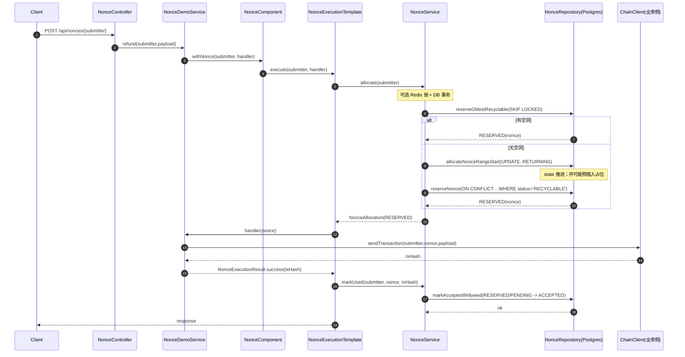
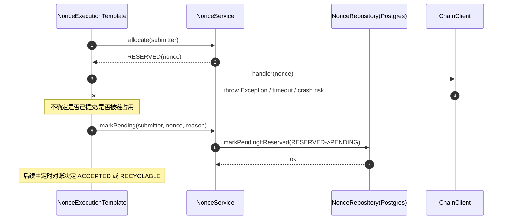
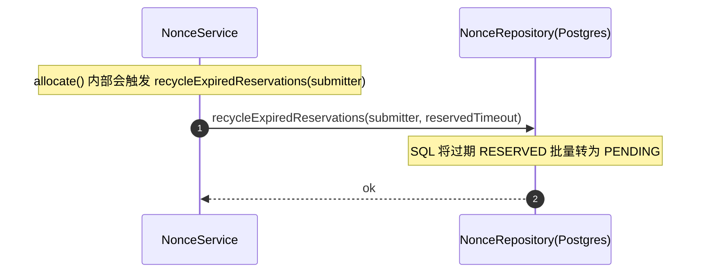
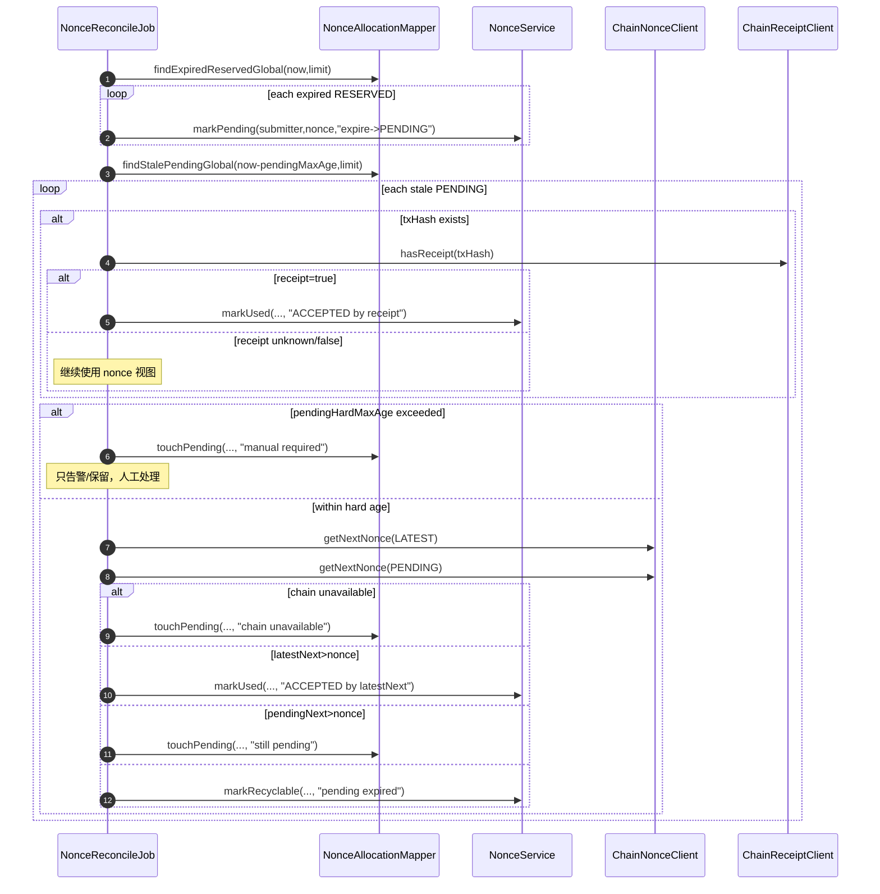

## nonce-demo 总体架构、时序与运行逻辑（基于当前实现）

> 本文用于：快速理解 nonce-demo 的整体链路、关键模块职责、以及多线程/多节点下的安全兜底策略。

---

## 1. 总体架构图（模块/依赖）

```mermaid
flowchart TB
  subgraph Client[调用方]
    U[HTTP Client / 业务系统]
  end

  subgraph Demo[demo 层（宿主应用）]
    C[NonceController]
    DS[NonceDemoService]
    CFG[NonceComponentConfiguration]
    JOB1[NonceReconcileJob
(定时对账)]
    JOB2[NonceCleanupJob
(可选清理)]
  end

  subgraph Core[core 组件层]
    NC[NonceComponent (Facade)]
    TPL[NonceExecutionTemplate]
    SVC[NonceService]

    subgraph Chain[链抽象]
      CNC[ChainNonceClient
(getNextNonce(tag))]
      CRC[ChainReceiptClient
(hasReceipt)]
      TAG[ChainBlockTag
EARLIEST/LATEST/PENDING/SAFE/FINALIZED/ACCEPTED]
    end

    subgraph Cache[本地缓存]
      CM[NonceCacheManager (Caffeine)]
      CE[NonceCacheEntry]
    end

    subgraph Lock[分布式锁（可选）]
      RLM[RedisLockManager]
      RDL[RedisDistributedLockManager]
      TLS[TransactionLockSynchronizer]
    end

    subgraph Repo[Repository / Persistence]
      REP[NonceRepository]
      PGR[PostgresNonceRepository]
      M1[SubmitterNonceStateMapper.xml]
      M2[NonceAllocationMapper.xml]
    end
  end

  subgraph Infra[基础设施]
    PG[(PostgreSQL)]
    RD[(Redis)]
    RPC[(Chain RPC / Node)]
  end

  U --> C --> DS --> NC --> TPL --> SVC

  CFG -. bean wiring .- NC
  CFG -. bean wiring .- CNC
  CFG -. bean wiring .- CRC
  CFG -. bean wiring .- CM

  SVC --> CM
  SVC --> TLS --> RLM
  RLM --> RDL --> RD

  SVC --> REP --> PGR --> M1 --> PG
  SVC --> REP --> PGR --> M2 --> PG

  CNC --> TAG
  CNC --> RPC
  CRC --> RPC

  JOB1 --> M2
  JOB1 --> SVC
  JOB1 --> CNC
  JOB1 --> CRC

  JOB2 --> M2
```

---

## 2. 核心数据与状态（DB 视角）

### 2.1 关键表
- **`submitter_nonce_state`**：每个 submitter 一行游标（`next_local_nonce`），通过 `UPDATE ... RETURNING` 原子推进。
- **`submitter_nonce_allocation`**：nonce 分配记录（状态机、锁定信息、txHash、原因）。

### 2.2 allocation 状态机（与链视图对齐的命名）
- **RESERVED**：已分配给业务，尚未确认链结果。
- **PENDING**：隔离态（不确定是否已提交/是否被链占用），禁止回收复用，由对账任务最终定案。
- **ACCEPTED**：认为该 nonce 已不可复用（强证据 receipt、或链上 next nonce 已推进）。
- **RECYCLABLE**：确认可复用。

> 兼容：历史数据中若存在 `USED`，当前实现按 `ACCEPTED` 语义处理。

---

## 3. 关键时序图

### 3.1 正常成功链路（allocate → sendTx → ACCEPTED）



### 3.2 handler 异常链路（不确定性 → PENDING 隔离）



### 3.3 超时回收链路（RESERVED 过期不直接回收 → PENDING）



### 3.4 对账定案（PENDING → ACCEPTED / RECYCLABLE / 保留）



---

## 4. 各模块运行逻辑（要点版）

### 4.1 demo/web
- **`NonceController`**：HTTP 入口。
- **DTO**：`NonceRequest/NonceResponse`。

### 4.2 demo/service
- **`NonceDemoService`**：示例业务逻辑：通过模板拿 nonce，然后发送交易。
- **`NonceReconcileJob`**：
  - 周期性把过期 RESERVED 转 PENDING
  - 对 PENDING 做定案：receipt 优先；否则 nonce 视图
  - 链不可用：保持 PENDING + 告警
  - 超过 `pendingHardMaxAge`：保持 PENDING + 告警（人工处理）
- **`NonceCleanupJob`（可选）**：按热窗口批量删除历史终态（默认关闭；生产建议分区/归档）

### 4.3 core/execution
- **`NonceExecutionTemplate`**：统一封装“分配 → handler → 状态更新”。
  - handler 成功：ACCEPTED
  - handler 异常：PENDING（隔离）

### 4.4 core/service
- **`NonceService.allocate`**：
  - 可选 Redis 锁（降低热点竞争）
  - 优先捡洞：`reserveOldestRecyclable(SKIP LOCKED)`
  - 无洞：推进 state 获取新区间起点，再 `reserveNonce`
  - 在分配路径内会触发“过期 RESERVED 处理”（当前实现为转 PENDING）
- **`markPending/markUsed/markRecyclable`**：对外暴露的状态更新入口（事务中）。

### 4.5 core/repository + mapper xml
- **原子推进**：`submitter_nonce_state` 用 `UPDATE ... RETURNING`。
- **捡洞并发安全**：`FOR UPDATE SKIP LOCKED`。
- **防重复分配**：`reserveNonce` 使用 `ON CONFLICT(submitter,nonce)` 且 `WHERE status='RECYCLABLE'`。
- **状态转换并发安全**：对 ACCEPTED/RECYCLABLE/PENDING 使用条件更新（`WHERE status IN (...)`）。

### 4.6 core/chain
- **`ChainNonceClient`**：按 `ChainBlockTag` 返回 next nonce（负数表示不可用）。
- **`ChainReceiptClient`**：强证据（receipt）。默认 noop，生产需注入真实实现（例如基于 web3j 4.9.8）。

---

## 5. 关键配置（建议默认）

- **`nonce.reserved-timeout`**：不要过短；超时后不直接回收，转 PENDING。
- **`nonce.pending-max-age`**：5~15 分钟（触发对账定案）。
- **`nonce.pending-hard-max-age`**：1~6 小时（超时不自动定案/回收，只告警）。
- **`nonce.reconcile-enabled`**：生产建议开启。
- **`nonce.cleanup-enabled`**：默认关闭；生产建议用分区/归档替代。

---

## 6. 生产化注意事项（最短清单）

- **索引**（必须）：
  - `UNIQUE(submitter, nonce)`
  - `(submitter, status, nonce)`（捡洞/查记录）
  - `(status, locked_until)`（过期 RESERVED 扫描）
  - `(status, updated_at)`（PENDING 扫描/对账）
- **链不可用策略**：保持 PENDING + 告警，避免误回收。
- **强证据优先**：尽量接入 `txHash -> receipt`。
- **数据治理**：占位/历史记录长期会膨胀，最终应分区/归档；demo 清理仅作示例。
