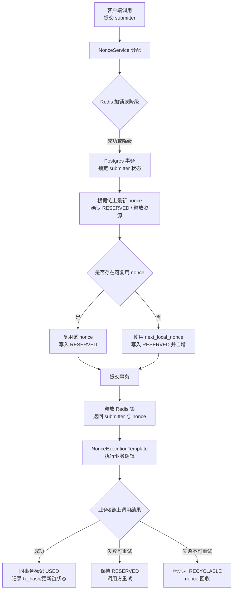

# Nonce Demo 构建方案（基于 submitter + nonce）

> 本方案只需传入 `submitter`，返回连续且可复用的 `nonce`，Redis 负责加速，Postgres 与区块链负责数据真相。

---

## 1. 背景与目标

- 多节点 Java 服务需要为 **每个 submitter** 生成从 0 开始、步长 1 的连续 nonce。
- 同一节点内不同 submitter 可多线程并发使用该能力；同一个 submitter 则通过 Redis 锁 + Postgres 行级锁串行，确保无冲突。
- 任意时刻，一个 nonce 只能绑定一笔交易；失败或未发出的 nonce 必须能复用。
- Redis 可用但非唯一真相；若宕机需自动降级到纯 Postgres 模式；区块链是最终真相和灾备来源。
- 设计原则：将 nonce 能力实现为一个 **独立组件 + 工具库**，对业务侧而言是黑盒，只暴露少量简单接口，内部负责所有并发控制、状态机和容灾。
- 项目交付目标：
  1. 提供一个可复用的 `NonceComponent`（或 `NonceUtils`）API：输入 `submitter`，业务可方便地获取并使用安全的 nonce。
  2. 业务方只通过组件接口使用 nonce，无需关心 Redis、Postgres、状态流转和灾备细节。

---

## 2. 总体架构

```
Client → Biz API → NonceExecutionTemplate
              ↓            ↑
        Redis 锁 + Postgres 事务
              ↓
   ChainClient（由业务实现的链路适配）
```

- **Redis**：
  - `nonce:lock:{submitter}`：按 submitter 维度的分布式锁，用来减少热 submitter 在 DB 上的行锁竞争；
  - `nonce:state:{submitter}`（可选）：缓存最近一次成功分配后的 `last_chain_nonce`、`next_local_nonce` 等元数据，供监控/读接口使用（**分配时仍以 Postgres 为唯一真相，不从缓存直接决定分配结果**）。
- **Postgres**：三张核心表保留所有状态；唯一真相。
- **Blockchain**：对账、恢复、验证 nonce 连续性。

---

## 3. 核心数据模型（Postgres）

| 表 | 关键字段 | 说明 |
| --- | --- | --- |
| `submitter_nonce_state` | `submitter`(PK), `last_chain_nonce`, `next_local_nonce`, `updated_at` | 每个 submitter 一行；`last_chain_nonce` 记录链上已确认连续到的最大 nonce；`next_local_nonce` 只在发新号时 +1。 |
| `submitter_nonce_allocation` | `id`, `submitter`, `nonce`, `status`, `lock_owner`, `tx_hash`, `updated_at` | 每个 nonce 的生命周期。`UNIQUE(submitter, nonce)` 防重号。`status` 建议只保留 3 种：`RESERVED`（占用待执行业务）、`USED`（同步业务及链上成功）、`RECYCLABLE`（可复用空位，包含所有失败/超时/放弃场景）。 |

迁移脚本位于 `src/main/resources/db/migration`，新增字段/索引按 Flyway 版本管理。

---

## 4. 核心流程（Mermaid）



---

## 5. 组件与工具库的封装与使用方式

### 5.1 对业务方暴露的黑盒接口

业务方只需要依赖一个工具类/组件，例如：

- `NonceComponent.withNonce(submitter, handler)`：推荐方式，在一次调用中“获取 nonce → 执行业务逻辑 → 根据结果自动回收/确认 nonce”。
- 可选：`NonceComponent.allocate(submitter)` / `NonceComponent.markUsed(submitter, nonce)` / `NonceComponent.markRecyclable(submitter, nonce)` 等低阶接口，仅供特殊场景使用。

典型业务调用思路（不限制具体代码风格）：

1. 在业务服务中注入 `NonceComponent`。
2. 调用 `withNonce(submitter, handler)`，在 handler 中：
   - 使用 `ctx.getNonce()` 获取当前安全的 nonce；
   - 写入本地业务表；
   - 同步调用链上接口；
   - 根据执行结果正常返回或抛出异常。
3. 组件在内部根据结果：
   - 成功：把当前 nonce 标记为 `USED`；
   - 失败：把当前 nonce 标记为 `RECYCLABLE`，释放以供下次复用。

业务侧无需写任何 Redis/DB/状态机相关代码，只需实现 handler 即可。

### 5.2 组件内部的职责分层（业务不可见）

为保持实现干净整洁、易于复用，组件内部按层拆分，但对外依然是一个黑盒：

- **门面层 `NonceComponent` / `NonceUtils`**
  - 只负责提供统一入口和简单的类型签名；
  - 将所有调用委托给内部的执行模板和领域服务。

- **执行模板层 `NonceExecutionTemplate`**
  - 封装“获取 nonce → 执行业务 handler → 按结果更新状态”的通用逻辑；
  - 负责：
    - 调用 `NonceService` 分配 nonce；
    - 执行 handler，并为其提供上下文（包含 submitter、nonce 等信息）；
    - 在成功时将 allocation 状态标记为 `USED`；
    - 在失败/异常时将 allocation 状态标记为 `RECYCLABLE`；
    - 在 finally 中释放 Redis 锁、清理 `lock_owner`。

- **领域服务层 `NonceService`**
  - 专注于“如何为某个 submitter 分配一个正确的 nonce”：
    - 使用 `RedisLockManager` 获取 per-submitters 分布式锁（失败自动降级）；
    - 在 Postgres 事务内：
      - 锁定 `submitter_nonce_state`；
      - 依据链上最新已确认的 nonce 对齐本地状态（将 `<=链上值` 的 `RESERVED` 标记为 `USED`，更新 `last_chain_nonce`）；
      - 优先取 `RECYCLABLE` 中的最小 nonce 复用，否则使用 `next_local_nonce` 并自增；
      - 插入/更新 allocation 为 `RESERVED`。
  - 不关心业务具体做什么，只关心 nonce 分配的正确性与并发控制。

- **基础设施层（组件内）**
  - `NonceRepository`：封装所有对 `submitter_nonce_state` 与 `submitter_nonce_allocation` 的 SQL 操作；
  - `RedisLockManager`：统一管理 `nonce:lock:{submitter}` 的加锁/解锁和降级逻辑；
  - 链上查询：在 `NonceService` 内部可直接调用链上接口（示例为伪代码），将 `RESERVED → USED` 的纠偏交给链上最新 nonce。
- **业务侧扩展**
  - `ChainClient` 等外围依赖由业务自行实现，并通过 handler 闭包或依赖注入使用；组件仅提供 submitter/nonce 上下文，不感知外部实现细节。

整体上，业务侧只接触门面层，其余细节完全封装在组件内部，达到“黑盒复用”的目标。

---

## 6. 项目模块规划（以组件/库为中心）

1. **`nonce-core` 组件模块**（或 `com.demo.nonce.core` 包）
   - 对外暴露：
     - `NonceComponent` / `NonceUtils`：业务唯一依赖的门面类。
     - 若需要，暴露简单的 `NonceConfig` 供宿主应用配置。
   - 内部包含：
     - `NonceService`：核心分配逻辑（Redis 锁 + Postgres），同 submitter 串行、不同 submitter 多线程并发。
     - `NonceExecutionTemplate`：封装“获取 nonce → 执行业务 handler → 状态流转”的模板。
     - `NonceRepository`、`RedisLockManager` 等基础设施实现。

2. **业务服务模块（多个）**
   - 各业务服务通过依赖 `nonce-core` 组件，使用 `NonceComponent.withNonce(...)` 完成自己的业务场景。
   - 业务模块不直接访问 nonce 的表结构，不拼装状态机逻辑，只在 handler 中写入业务数据、调用链上接口。

3. **接口层模块（可选）**
   - 若需要通过 HTTP/gRPC 对外提供“统一的 nonce 服务”，可在单独模块中创建 REST/Dubbo 接口，仅调用 `NonceComponent`。

> 建议先以单模块的 `nonce-core` 实现组件功能，并在同一工程内编写一个简单的业务示例，之后再按需要拆分为独立库供多个服务复用。

---

## 7. 构建步骤（建议顺序）

1. **初始化数据库层**
   - 确认 Postgres/Flyway 可用。
   - 建好 `submitter_nonce_state`、`submitter_nonce_allocation`，配置唯一约束与索引。
2. **实现 NonceService**
   - Redis 操作封装：`tryLockSubmitter`, `releaseLock`，支持降级。
   - Postgres 事务：`SELECT ... FOR UPDATE`、复用洞、新号逻辑、`UNIQUE(submitter, nonce)` 约束处理。
3. **实现 NonceExecutionTemplate**
   - 提供 `execute(submitter, handler)`；在 handler 中注入 `nonce`, `txContext`。
   - 统一处理 SUCCESS / FAILURE 的状态流转：SUCCESS 标记为 `USED`，FAILURE 标记为 `RECYCLABLE` 并释放 nonce。
4. **实现 API/业务控制器**
   - 通过模板包裹业务逻辑：本地事务写业务数据 + 同步调用链上接口。
   - 配置重试策略（如 Spring Retry）或失败告警。
5. **监控与降级**
   - Redis 不可用 → 自动跳过锁并记日志。
   - 暴露指标：模板耗时、状态变化次数、redis 降级次数、链上失败率。

---

## 8. 灾难处理与恢复策略

即便采用同步闭环，也要对“数据库异常”“链上数据不一致”“Redis 故障”等情况具备动态感知与自动修复能力。

### 8.1 检测维度

- **数据库健康检查**
  - 通过连接池/`SELECT 1` 失败、Flyway 校验失败等指标触发。
  - 当检测到事务提交失败或读取异常时，模板立即返回可重试错误，避免消耗 nonce。
- **链上状态漂移**
  - 每次成功调用链上接口后，记录链上返回的 `txHash` 和序列号。
  - 定期（或在模板内按需）调用 `chainClient.queryLatestNonce(submitter)`，对比本地 `last_chain_nonce`，若发现滞后则触发纠偏。
- **Redis 降级**
  - 任何 Redis 操作超时/失败时，自动标记为“降级模式”，并上报指标；模板改为纯 Postgres 流程。

### 8.2 自动化恢复闭环

1. **本地数据库仍可用**
   - 通过 `submitter_nonce_state` 与 `submitter_nonce_allocation` 即可恢复所有状态；
   - 若检测到链上确认数大于本地 `last_chain_nonce`，调用 `NonceRecoveryService.alignWithChain(submitter)`：
     1. 查询链上最新确认 nonce：`chainMax`.
     2. 在一个事务中：`UPDATE submitter_nonce_state SET last_chain_nonce = chainMax`.
     3. 将 `nonce <= chainMax` 的 allocation 直接标记为 `USED`（或 `CONFIRMED`），并清理 `lock_owner`。
     4. 对 `>chainMax` 但停留在 `RESERVED` 的记录，根据业务策略重新设为 `RECYCLABLE`，以便下次复用。

2. **数据库损坏 / 恢复到旧备份**
   - 启动“全量对账模式”：
     - 对所有 submitter（或热点 submitter）扫描链上交易，构建最新的 `last_chain_nonce`。
     - 重建 `submitter_nonce_state`：`next_local_nonce = last_chain_nonce + 1`。
     - 对 allocation 表可执行以下策略：
       - 仅重建必要的 `USED` 记录（可选）。
       - 或清空旧数据，按 `last_chain_nonce` 起点重新分配，未使用的 nonce 由模板重新生成。
   - 此模式可配置开关：如检测到“本地 `last_chain_nonce` 明显小于链上连续值”时自动触发。

3. **链上节点返回异常 / 超时**
   - 模板将 handler 结果视为 FAILURE，直接把本次 nonce 标记为 `RECYCLABLE` 并释放；
   - 上层如需重试，重新调用模板获取新的 nonce，确保不会有“半用半占”的中间状态。

### 8.3 监控与告警

- **核心指标**
  - Redis 降级次数、降级持续时间。
  - `RESERVED` 状态滞留数量（判定是否有 handler 卡住）。
- `RECYCLABLE` 的增长率（提示链上错误或业务异常）。
  - `last_chain_nonce` 与链上真实值的差距。
- **告警策略**
  - `RESERVED` 超过阈值 → 自动触发清理或通知人工。
  - 链上对齐失败 → 自动进入全量对账模式，并告警。
  - Redis 长时间不可用 → 告警但系统依旧可运行。

通过以上检测 + 自动校正 + 指标监控，即可形成一个“动态判断灾难、自动恢复、必要时人工介入”的闭环，满足高级灾备要求。

---

## 9. 环境依赖 & 配置

| 组件 | 要求 | 说明 |
| --- | --- | --- |
| Java | 1.8 | 与 `pom.xml` 保持一致。 |
| Postgres | 14 | 需开启事务隔离（默认 READ COMMITTED 即可）。 |
| Redis | Cluster / Sentinel | 键：`nonce:lock:{submitter}`；TTL 10s，可按压力调优。 |
| Blockchain 接口 | 已封装 SDK 或 HTTP RPC | 需提供同步发送、返回 txHash/确认状态的接口。 |

配置项（`application.yml` 示例）：

- `nonce.redis.enabled`
- `nonce.lock.ttl`
- `nonce.template.retry.max-attempts`
- `nonce.chain.client.*`

---

## 10. 测试计划

1. **单元测试**：NonceService 并发复用洞、新号、Redis 降级。
2. **模板测试**：模拟 SUCCESS / RETRYABLE / NON_RETRYABLE，校验状态转换。
3. **链上调用测试**：mock chainClient 抛错/超时，验证 nonce 保持 RESERVED 或回收。
4. **多线程集成测试**：多 submitter 并发、同 submitter 重试，确保 `UNIQUE(submitter, nonce)` 无冲突。

---

## 11. 下一步

1. 审阅本 README 并补充项目特有约束。
2. 根据章节顺序创建具体代码结构与配置。
3. 实施构建、编写文档与自动化测试。
4. 准备后续上线运行手册、监控面板。

> 审阅确认后，将按照本方案逐步构建实现。欢迎随时提出修改意见。


