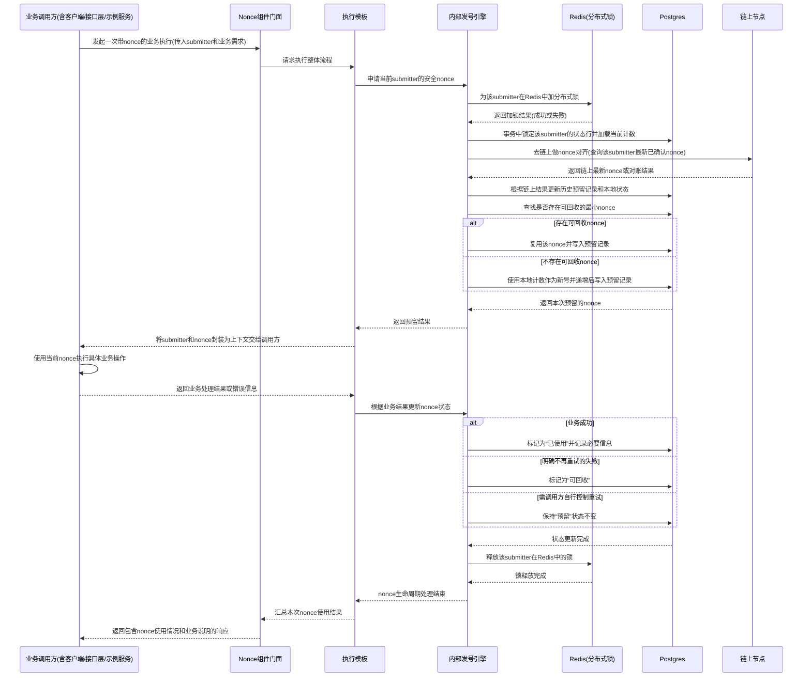

```mermaid
sequenceDiagram
    participant Caller as 业务调用方(含客户端/接口层/示例服务)
    participant Facade as Nonce组件门面
    participant Template as 执行模板
    participant Engine as 内部发号引擎
    participant R as Redis(分布式锁)
    participant DB as Postgres
    participant Chain as 链上节点

    Caller->>Facade: 发起一次带nonce的业务执行(传入submitter和业务需求)
    Facade->>Template: 请求执行整体流程

    Template->>Engine: 申请当前submitter的安全nonce
    Engine->>R: 为该submitter在Redis中加分布式锁
    R-->>Engine: 返回加锁结果(成功或失败)

    Engine->>DB: 事务中锁定该submitter的状态行并加载当前计数
    Engine->>Chain: 去链上做nonce对齐(查询该submitter最新已确认nonce)
    Chain-->>Engine: 返回链上最新nonce或对账结果
    Engine->>DB: 根据链上结果更新历史预留记录和本地状态
    Engine->>DB: 查找是否存在可回收的最小nonce
    alt 存在可回收nonce
        Engine->>DB: 复用该nonce并写入预留记录
    else 不存在可回收nonce
        Engine->>DB: 使用本地计数作为新号并递增后写入预留记录
    end
    DB-->>Engine: 返回本次预留的nonce
    Engine-->>Template: 返回预留结果

    Template-->>Caller: 将submitter和nonce封装为上下文交给调用方
    Caller->>Caller: 使用当前nonce执行具体业务操作
    Caller-->>Template: 返回业务处理结果或错误信息

    Template->>Engine: 根据业务结果更新nonce状态
    alt 业务成功
        Engine->>DB: 标记为“已使用”并记录必要信息
    else 明确不再重试的失败
        Engine->>DB: 标记为“可回收”
    else 需调用方自行控制重试
        Engine->>DB: 保持“预留”状态不变
    end
    DB-->>Engine: 状态更新完成

    Engine->>R: 释放该submitter在Redis中的锁
    R-->>Engine: 锁释放完成

    Engine-->>Template: nonce生命周期处理结束
    Template-->>Facade: 汇总本次nonce使用结果
    Facade-->>Caller: 返回包含nonce使用情况和业务说明的响应
```