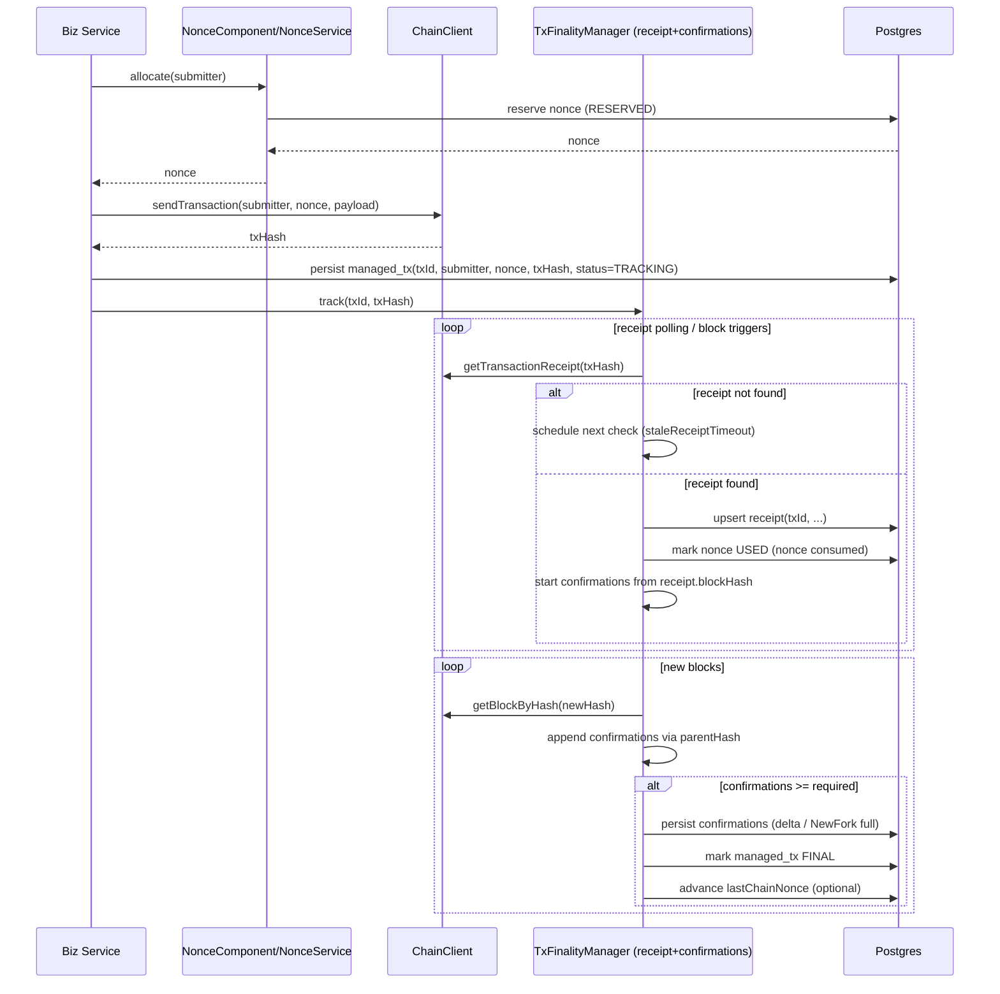

# FireFly Transaction Manager（FFTM）的 Receipt / Confirmations 机制深度解析  
_以及在本项目（nonce-demo）中如何落地复用来解决“缺少链上最终真相/对账/finality”问题_  

> 本文聚焦 **FFTM 内部的 receipt（回执）与 confirmations（确认数 / finality）机制**：它如何运行、为何这么设计、如何与持久化/事务处理/事件流交互；以及我们在当前 Java nonce-management 项目中如何借鉴这套机制补齐链上闭环。  
>
> 代码参考范围：`firefly/firefly-transaction-manager/` 与本仓库 Java 代码 `src/main/java/com/work/nonce/`。  

---

## 1. 背景：为什么 “receipt + confirmations” 是 nonce 管理的必需拼图

在 EVM 语义下，nonce 的“最终真相”来自链：  

- **交易是否真的被节点接受 / 广播成功**：仅凭拿到 `txHash` 并不保证最终一定上链（可能被丢弃、替换、节点重启丢 mempool 等）。  
- **交易是否被打包（mined）**：打包后才会产生 **receipt**。  
- **交易是否最终不可逆（final）**：PoW/部分 PoS 链存在 reorg 风险，需要等待一定区块数（**confirmations**）才能认为“最终确定”。  
- **nonce 是否被消耗**：只要交易被打包（无论成功/失败/revert），nonce 都会被消耗；这与“业务是否成功”是两回事。  

而我们当前 Java 项目（`nonce-demo`）的主要问题之一是：  

- **`NonceExecutionTemplate` 在 handler 返回 `SUCCESS`（拿到 txHash）就调用 `markUsed()`**，并且 `NonceAllocationStatus.USED` 的注释写的是“链上调用均成功”。但我们**没有 receipt/finality 的闭环**来证明“链上成功”，也没有机制把“链上失败/回滚/重组/丢单”的事实回灌进本地状态。  
- `SubmitterNonceState.lastChainNonce` 在现有实现中也没有形成可持续更新的闭环（`CODE_ANALYSIS_REPORT.md` 明确指出 “lastChainNonce 从未使用”）。  

所以，我们需要一个链上确认机制来回答三个关键问题：  

- **Q1：什么时候可以把 nonce 从“占用中”变成“已消耗”**（避免过早 USED 或错误回收）？  
- **Q2：什么时候可以认为交易结果“最终确定”**（抵抗 reorg，形成对账/恢复锚点）？  
- **Q3：在“交易迟迟无回执/可能漏块/链重组”时如何恢复一致视图**（避免乱序、避免漏更新）？  

FFTM 的 receipt/confirmations 机制，正是为了解决以上问题而设计的一套通用框架。

---

## 2. FFTM 中相关组件与边界（谁负责什么）

FFTM 里围绕 receipt/confirmations 有四类核心角色：

- **Block listener（新区块通知）**  
  - 由 connector 实现，向 FFTM 推送新区块 hash 列表（或通过 polling/websocket）。  
  - FFTM 侧通过 `internal/blocklistener.BufferChannel` 做缓冲与“漏块风险”标记（`GapPotential`）。  

- **Confirmations Manager（确认管理器）**：`internal/confirmations/confirmations.go`  
  - 维护一个内存中的 `pending` 集合（交易/事件两类）。  
  - 接收两类输入：
    - `NewTransaction`：开始跟踪某 `txHash`（receipt + confirmations）。  
    - `NewBlockHashes`：链头推进（可能包含多个 block hash）。  
  - 输出两类回调：
    - **receipt 回调**：拿到 receipt 后通知交易处理器。  
    - **confirmations 回调**：确认数增量/分叉重算/已满足阈值。  

- **Receipt Checker（回执检查器）**：`internal/confirmations/receipt_checker.go`  
  - 多 worker 并发轮询 `TransactionReceipt(txHash)`。  
  - 队列使用链表 + `sync.Cond`，避免“固定长度队列把关键路径阻塞”。  
  - 对除 NotFound 以外的错误采取 **无限重试**（带 backoff）。  

- **Transaction Handler（交易策略/状态机）**：以 `pkg/txhandler/simple/policyloop.go` 为例  
  - **Confirmations Manager 不直接改数据库**；它只负责“发现事实”（receipt/confirmations）。  
  - Transaction Handler 在回调里把事实写入持久化（receipt/confirmations），并驱动交易状态机从 `Tracking` → `Confirmed` → `Succeeded/Failed`。  

此外还有 **Persistence**（持久化实现）：

- **Postgres 模式**：receipt 与 confirmations 是独立表，由 `transaction_writer` 批量写入（异步）  
  - `db/migrations/postgres/000002_create_receipts_table.up.sql`  
  - `db/migrations/postgres/000003_create_confirmations_table.up.sql`  
  - `internal/persistence/postgres/receipts.go` / `confirmations.go` / `transaction_writer.go`  

- **LevelDB 模式**：receipt/confirmations 直接嵌在 `TXWithStatus` 的单 JSON 文档里  
  - `internal/persistence/leveldb/leveldb_persistence.go`  

---

## 3. 核心概念澄清：Receipt、Confirmations、Finality、Fork

### 3.1 Receipt 是什么？

Receipt（交易回执）是“交易被打包进某个区块后的链上结果”，典型字段包含：

- `BlockNumber` / `BlockHash` / `TransactionIndex`  
- `Success`（EVM receipt status：1=success，0=revert）  
- 以及 connector 可能提供的 `ProtocolID`、`ExtraInfo`、`ContractLocation` 等  

在 FFTM 中，receipt 的来源是 connector 的：

- `ffcapi.API.TransactionReceipt(ctx, &TransactionReceiptRequest{TransactionHash: ...})`

### 3.2 Confirmations 是什么？

Confirmations 在 FFTM 的定义里是：

- **从“包含该交易的区块（receipt 给出 blockHash）”开始，后面连续在 canonical chain 上追加的区块数量**  
- 即“交易所在区块之后，链又稳定地延伸了 N 个区块”的置信度指标  

FFTM 通过配置 `confirmations.required` 指定需要多少 confirmations 才认为 final。  

### 3.3 Fork / reorg 如何体现？

FFTM 不是靠“订阅 removed logs”这类 connector 特性来完成所有 reorg 检测（虽然它也支持 RemovedEventLog 这类通知），而是更核心地依赖：

- **区块 parentHash 链接关系**  
- 对同一个 pendingItem，历史已通知的 confirmations 列表与新计算出来的 confirmations 列表发生了“同一位置 blockHash 不一致”，即认为发生 fork，需要 **全量重算**。  

FFTM 用 `ConfirmationsNotification.NewFork` 明确告诉上层：

- `NewFork=false`：Confirmations 是**增量 append**（可高效落库）  
- `NewFork=true`：Confirmations 是**全量列表**（上层应清空旧 confirmations 再写入）  

---

## 4. 运行原理：从 txHash 到 “receipt + confirmations + final”

下面按时间顺序描述交易（transaction）的链路（事件 event log 的路径类似，但它天然知道 blockNumber/blockHash）。

### 4.1 交易进入 Tracking：TxHandler 通知 Confirmations Manager

在 FFTM `simple` handler 中，交易被提交后会有 `TransactionHash`，此时：

- `policyloop.go` 会检测到 `pending.trackingTransactionHash != mtx.TransactionHash`  
- 触发 `EventHandler.HandleEvent(ManagedTXTransactionHashAdded)`  
- 最终在 `pkg/fftm/transaction_events_handler.go` 里调用：
  - `confirmations.Manager.Notify(NewTransaction{txHash, receiptCallback, confirmationsCallback})`

这一步的设计要点：

- **Confirmations Manager 的输入是 `txHash`**，而不是 `txID`。  
- 回调闭包里把 `txID` 绑定住（`txID := e.Tx.ID`），这样 confirmations manager 无需了解持久化/状态机细节。  

### 4.2 Confirmations Manager 维护 pendingItem，并可选择“入队即查 receipt”

`internal/confirmations/confirmations.go`：

- `Notify(NewTransaction)` → 构造 `pendingItem{pType=transaction, txHash, callbacks...}`  
- 加入 `bcm.pending` map（key 是 `TX:th=<txHash>`）  
- 如果 `confirmations.fetchReceiptUponEntry=true`，则马上 `receiptChecker.schedule()`  

关键配置项：

- `confirmations.fetchReceiptUponEntry`  
  - `true`：更快发现已打包交易（尤其在刚启动/恢复时）  
  - `false`：只在收到新块或 stale 超时后才触发 receipt check（降低 RPC 压力）  

### 4.3 Receipt Checker：异步多 worker 轮询 receipt

`internal/confirmations/receipt_checker.go` 的核心策略：

- 队列是 `list.List + sync.Cond`：  
  - **没有固定长度**，避免把关键路径（Notify）阻塞住  
  - 通过 `pending.queuedStale` 标记避免重复入队  

- worker 并发：`confirmations.receiptWorkers`  

- 对错误的处理极其关键：  
  - `ErrorReasonNotFound` / `nil receipt`：认为“暂未出回执”，更新 `lastReceiptCheck`，不重试（等待下次调度）  
  - 其他错误：把 item 放回队尾，然后通过 `retry.Do()` 的 backoff 延迟继续尝试  
  - **这意味着：对于节点抖动/短暂错误，FFTM 会无限重试直到恢复或退出**  

- 成功拿到 receipt：通过 `bcm.Notify(receiptArrived)` 把结果交回主循环线程处理  

### 4.4 新区块输入：BlockHashEvent → BlockInfo → 两类动作

Confirmations Manager 有一个长期运行的主循环 `confirmationsListener()`，核心输入源是：

- `bcm.newBlockHashes <- *ffcapi.BlockHashEvent`  
  - 这个 channel 的数据来自：`manager.Start()` 调用 connector 的 `NewBlockListener()`  
  - 其输入 channel 由 `blocklistener.BufferChannel(ctx, m.confirmations)` 包一层（见 4.7）  

每次收到新块 hash 列表，Confirmations Manager 会：

1) **将区块通知“扇出”给 confirmed block listeners（可选功能）**  
2) **逐个 blockHash 拉取 block header 信息**：`BlockInfoByHash(blockHash)`  
3) 执行两类处理：

- **A. 发现“某 txHash 已经出现在某个 block 的 tx hash 列表里”**  
  - `processBlock()` 会遍历 `block.TransactionHashes`  
  - 如果 `pending` 里存在同 txHash 的交易，并且 `pending.blockHash != block.BlockHash`  
  - 则认为“交易可能被打包/或者换了区块”，立即 schedule receipt check  

- **B. 对已知 receipt 的 pendingItem 追加 confirmations**  
  - 对每个 `pending.blockHash != ""` 的 item：  
    - 检查 `block.ParentHash == expectedParentHash` 且 `blockNumber == expectedBlockNumber` 时追加一条 Confirmation  
    - confirmations 数量达到 `requiredConfirmations` 时标记 `pending.confirmed=true`  
    - 调用 `dispatchConfirmations()` 通知上层（增量或全量）  

### 4.5 “一致链视图”与 walkChain：解决漏块/阻塞/重启期间不一致

Confirmations Manager 在每轮循环里会构造 `blockState`：

- `blockState.getByNumber(blockNumber, expectedParentHash)`  
  - 通过 `BlockInfoByNumber(allowCache=true)` 查询  
  - 有两个重要一致性约束：
    - **不会在同一轮循环里返回“更高区块号”的 block（如果较低区块号已经 nil）**  
    - **不会在同一轮循环里改变某个区块号对应的 hash**  

为什么要这样？  

> 因为 receipt/confirmations 的交付需要“链上顺序一致”，如果在遍历 pending 列表的过程中链头又推进了，可能造成后面的 item 先被确认、前面的 item 反而没被确认，从而出现乱序交付。  

当 `GapPotential=true` 或者内部判断 `blockListenerStale=true` 时，会触发：

- `walkChain(blocks)`：对所有 pendingItem（按 blockNumber/txIndex/logIndex 排序）逐个调用 `walkChainForItem()` 重建 confirmations 列表  

`walkChainForItem()` 的逻辑是：

- 如果 pending 还没有 receipt（`pending.blockHash==""`），跳过  
- 否则从 `receipt.blockNumber + 1` 开始沿着 parentHash 往后拉 block header  
- 直到：
  - 拉不到 block（链头还没到）  
  - 或 parentHash 不匹配（疑似 reorg / 不一致）  
  - 或 confirmations 达到 required  

达到 `confirmed` 或有 confirmations 增量时，就会调用 `dispatchConfirmations()`。  

### 4.6 dispatchConfirmations：增量 vs 全量，fork 语义的关键

`dispatchConfirmations(item)` 做了一个非常重要的事情：  

- 维护 `item.notifiedConfirmations`（上次已通知的列表）  
- 对比新计算的 `item.confirmations`：
  - 如果同一索引上 `BlockHash` 不一致 → `NewFork=true`，**本次通知携带全量 confirmations**  
  - 否则 `NewFork=false`，只通知 “新增的尾部 confirmations”  

这使得上层持久化可以高效：

- 大部分情况（链稳定）只写增量 confirmations  
- reorg 时才执行 “清空 + 写全量”  

### 4.7 BlockListener BufferChannel：阻塞时不让其它流被拖死，并显式标记 “可能漏块”

`internal/blocklistener/blocklistener.go` 的 `BufferChannel()` 解决一个常见系统性问题：

- 下游（confirmations manager）有一个固定长度队列：`confirmations.blockQueueLength`  
- 如果下游阻塞（例如某个事件流 block 处理被阻塞），不能让 connector 侧 block 通知也被阻塞，否则会导致：
  - **一个阻塞的 stream 影响所有 stream 的区块通知**  

BufferChannel 的策略：

- 始终从 connector 的输入 channel 读取（不反压 connector）  
- 如果下游写不进去：进入 “blocked mode”，丢弃后续 block 更新  
- 一旦恢复可写：
  - 把之前那条 “blockedUpdate” 发送给下游  
  - 并设置 `blockedUpdate.GapPotential=true`  

Confirmations Manager 收到 `GapPotential=true` 会将 `blockListenerStale=true`，下轮触发 `walkChain()` 做一致性重建。  

这套机制的思想很重要：  

- **宁可承认“我可能漏块了”，然后做一次确定性重建；也不要让系统在背压中无限堆积或全局卡死。**  

---

## 5. 持久化模型：receipt/confirmations 如何落库（以及为什么是“异步批量写”）

### 5.1 Postgres：receipt/confirmations 是独立表

表结构（简化说明）：

- **`receipts`**（`000002_create_receipts_table.up.sql`）  
  - `id` = `txID`（文本，唯一）  
  - `block_number` / `tx_index` / `block_hash` / `success` / `protocol_id` / `extra_info` / `contract_loc`  

- **`confirmations`**（`000003_create_confirmations_table.up.sql`）  
  - `id` = UUID（每条 confirmation 一个 record）  
  - `tx_id`（关联 txID）  
  - `block_number` / `block_hash` / `parent_hash`  
  - 并对 `tx_id` 建索引便于查询  

写入方式：

- Transaction Handler 收到通知后，调用 persistence 接口：  
  - `SetTransactionReceipt(txID, receipt)`  
  - `AddTransactionConfirmations(txID, clearExisting, confirmations...)`  

- Postgres 实现并不会立即写库，而是投递到 `transactionWriter`（异步批量）：
  - `internal/persistence/postgres/transaction_writer.go` 会把 receipt/confirmations 与 tx updates/history 统一批处理  

关键批处理逻辑（高层语义）：

- receipts：**upsert**（同 txID 的 receipt 可能更新/覆盖）  
  - 先尝试 `InsertMany(fallback=true)`，失败则逐条 `Upsert`  

- confirmations：  
  - 如果 `clearExisting=true`（对应 `NewFork=true`），先 `DeleteMany(txID)` 再插入新列表  
  - 否则只插入增量 confirmations  

为什么这么设计？  

- receipt/confirmations 的更新频率可能很高（每个新区块都可能触发一些确认增量）  
- 如果每次回调都立即写库，会引入大量小事务，吞吐与延迟都很差  
- 统一写入器还能保证“同一交易相关写操作”的顺序与合并效果，减少冲突  

### 5.2 LevelDB：receipt/confirmations 直接嵌在 TXWithStatus

在 LevelDB 模式下：

- `GetTransactionReceipt(txID)` 直接读 `TXWithStatus.Receipt`  
- `AddTransactionConfirmations()` 直接 append 到 `TXWithStatus.Confirmations`（若 `clearExisting` 则置空再 append）  

这适合轻量部署，但也意味着：

- confirmations 查询没有 rich query 的灵活性  
- 需要写整个大对象（但 LevelDB 的写入开销模型不同）  

---

## 6. Transaction Handler 如何“消费” receipt/confirmations：从 Tracking 到最终状态

以 `simple` handler 为例（`pkg/txhandler/simple/policyloop.go`）：

- `HandleTransactionReceiptReceived(txID, receipt)`：只把 `pending.receiptNotify` 与 `pending.receipt` 写入内存 pendingState，然后 `markInflightUpdate()`  
- `HandleTransactionConfirmations(txID, notification)`：写入 `pending.confirmations` 与 `pending.confirmed`，然后 `markInflightUpdate()`  

真正的落库与状态推进发生在下一次 policy loop cycle：

- 如果收到 receipt：
  - `TXPersistence.SetTransactionReceipt(txID, receipt)`  
  - 记录 history action：`TxActionReceiveReceipt`  

- 如果收到 confirmations：
  - `TXPersistence.AddTransactionConfirmations(txID, notification.NewFork, notification.Confirmations...)`  
  - 若 `Confirmed=true`：
    - 记录 history action：`TxActionConfirmTransaction`  
    - subStatus 切换为 `TxSubStatusConfirmed`  

- 当 `ctx.Confirmed==true`（且不是 delete）时，最终根据 receipt 的 `Success` 设置交易最终状态：
  - `Succeeded` 或 `Failed`  

这里有一个非常关键的语义：

- **receipt 的到达先于 confirmed 的到达（代码注释明确保证）**  
- 因为 confirmations 的计算依赖 receipt 提供的 `blockHash/blockNumber`  

---

## 7. 配置项全解（Confirmations 相关）

来自 `firefly-transaction-manager/config.md` 的 confirmations 配置：

- **`confirmations.required`**（默认 20）  
  - 达到多少 confirmations 才认为 final  
  - `0` 表示“收到 receipt 即认为 confirmed”（非常激进，不推荐在可能 reorg 的链上使用）  

- **`confirmations.staleReceiptTimeout`**（默认 1m）  
  - pending 交易超过该时长仍无 receipt，会被认为 stale，需要强制 re-check  

- **`confirmations.receiptWorkers`**（默认 10）  
  - 并发拉取 receipt 的 worker 数量  

- **`confirmations.notificationQueueLength`**（默认 50）  
  - confirmations manager 的通知队列长度（NewTransaction/NewEventLog 等）  

- **`confirmations.blockQueueLength`**（默认 50）  
  - confirmations manager 的新区块 hash 队列长度  
  - 结合 `blocklistener.BufferChannel` 可在阻塞时设置 `GapPotential` 并重建  

- **`confirmations.fetchReceiptUponEntry`**（默认 false）  
  - 新交易入队是否立刻查 receipt（恢复场景可考虑开）  

- **`confirmations.retry.*`**（initialDelay/maxDelay/factor）  
  - receipt checker 的 backoff 重试策略（针对非 NotFound 的错误）  

---

## 8. 这套机制解决了哪些“硬问题”（以及背后的设计哲学）

### 8.1 不阻塞关键路径：链表队列 + cond

对外部调用方（TxHandler）而言，`Notify(NewTransaction)` 不能被一个慢节点/慢查询卡住。  
所以 receipt checker 不使用固定长度队列，而使用链表与条件变量，工作线程慢也不会阻塞入队。  

### 8.2 明确面对“不确定性”：GapPotential + walkChain 重建一致视图

在真实系统里，“漏块/阻塞/重连”必然发生。  
FFTM 不试图假装“永远不会漏”，而是：

- 一旦发现可能漏（GapPotential=true），就承认不确定性  
- 下一轮把所有 pendingItem 按顺序重走一遍 canonical chain（walkChain）  
- 用 `blockState` 保证一轮内链视图一致，避免乱序交付  

### 8.3 reorg 时从“增量”退化为“全量对账”

稳定时：增量 confirmations 低成本写入。  
不稳定时：通过 `NewFork=true` 触发“清空 + 写全量”，把复杂性交给明确的分叉语义。  

### 8.4 业务处理与链事实解耦

Confirmations Manager：发现事实（receipt/confirmations）。  
TxHandler：决定策略（何时认为成功、失败、是否 resubmit、状态机如何走）。  
Persistence：只是保存事实与状态快照。  

这让该机制可复用于不同链与不同业务策略。

---

## 9. 回到我们项目：目前问题是什么，FFTM 机制能解决什么

### 9.1 目前的关键问题（结合 `README.md` 与 `CODE_ANALYSIS_REPORT.md`）

- **我们把“拿到 txHash”当成“链上成功”**：  
  - `NonceExecutionTemplate` 在 `SUCCESS` 直接 `markUsed(submitter, nonce, txHash)`  
  - `NonceAllocationStatus.USED` 注释是“链上调用均成功”  
  - 但我们 demo 的 `ChainClient` 只有 `sendTransaction()`，没有 receipt/confirmations 查询  

- **没有 finality 的闭环，`lastChainNonce` 无法可靠推进**：  
  - `SubmitterNonceState.lastChainNonce` 在实现中几乎没用（报告中明确指出）  
  - 灾备/恢复/对账只能停留在“概念”，没有事实数据源  

- **“RECYCLABLE” 的语义风险**：  
  - 我们当前把“失败/超时/放弃”统一回收为 `RECYCLABLE`  
  - 但如果交易其实已经进入 mempool 或已被矿工打包（只是我们没观察到），回收会导致未来同 nonce 冲突（replacement/nonce too low/业务重复）  
  - 没有 receipt/finality，无法区分“真的没上链” vs “只是我们没看到”  

### 9.2 引入 receipt/confirmations 后，我们能得到的能力

- **把 nonce 的 USED 语义从“业务认为成功”改为“链已消耗（receipt 出现）”**  
  - 这对 nonce 正确性最关键  

- **用 confirmations.required 形成“最终确定点”**  
  - 可安全推进 `lastChainNonce`  
  - 可作为恢复/重启后的一致锚点  

- **在 reorg/漏块/重连情况下仍可重建一致链视图**  
  - 不会因为短暂不一致把状态写错  

---

## 10. 我们项目如何落地复用：两条路线（推荐路线 + 可选路线）

### 10.1 路线 A（推荐）：直接把 FFTM 作为外部服务/组件使用

如果我们允许引入 FireFly connector framework 的一部分作为基础设施，那么最省风险的方式是：

- 我们的 Java 服务不自己实现 receipt/confirmations  
- 而是把交易提交/跟踪交给 FFTM（或复用其 connector），Java 侧只对接：
  - “提交请求”  
  - “查询交易状态/receipt/confirmations”  
  - “订阅最终完成事件（成功/失败）”  

优点：

- reorg、漏块、重试、批处理持久化、监控指标等都由 FFTM 兜底  
- 我们只需把 nonce 分配与业务幂等对接好  

缺点：

- 引入新的服务/部署与运维成本  
- 需要链连接器（ffcapi）与 Java 生态的整合方案  

### 10.2 路线 B（可行，但实现量大）：在 Java 内复刻 FFTM 的最小子集

如果我们必须在 Java 内部实现这套机制，可以复刻 FFTM 的“最小可用闭环”：

- **ReceiptChecker（轮询 receipt）**  
- **BlockListener（订阅/轮询新区块 hash）**  
- **ConfirmationManager（按 parentHash 递推 confirmations，处理 fork/gap）**  
- **Persistence（保存 receipt/confirmations，以及 tx tracking 状态）**  

下面以路线 B 为主给出落地设计（因为它能直接映射到我们现有项目结构，且解释“如何用这套东西解决当前问题”更直观）。

---

## 11. 路线 B 详细落地方案：模块映射、数据模型、状态机与迁移步骤

### 11.1 模块映射（FFTM → 我们项目）

- **FFTM `ManagedTX`（交易管理对象）**  
  - 对应我们新增的 `ManagedTxEntity`（建议新增表）  
  - 关键字段：`txId`、`submitter`、`nonce`、`txHash`、`status`、`firstSubmit/lastSubmit`、`errorMessage` 等  

- **FFTM `ReceiptRecord` / `receipts` 表**  
  - 对应我们新增 `tx_receipts`（或沿用 FFTM receipts 表结构思想）  

- **FFTM `ConfirmationRecord` / `confirmations` 表**  
  - 对应我们新增 `tx_confirmations`（每条 confirmation 一行）  

- **FFTM confirmations manager（内存 pending + blockState）**  
  - 对应我们新增后台组件 `TxFinalityManager`（命名建议）  

- **FFTM ReceiptChecker（worker pool + backoff + 链表队列）**  
  - 对应我们新增 `ReceiptPoller`（或 `ReceiptChecker`）  

- **FFTM blocklistener.BufferChannel（阻塞丢弃 + GapPotential）**  
  - 对应我们新增 `BlockEventBuffer`（或者直接在事件总线上实现同语义）  

### 11.2 数据模型建议（重点：把“nonce 已消耗”与“业务成功”分离）

建议新增（或演进）如下模型：

#### 11.2.1 NonceAllocationStatus 的语义修正/扩展

当前：

- `RESERVED`：占用待执行  
- `USED`：注释写“链上成功”  
- `RECYCLABLE`：可回收  

建议：

- 保持三态，但修正语义：  
  - **`USED` = nonce 已被链消耗（receipt 出现），不等价于“业务成功”**  
  - “业务成功/失败”应由 tx receipt 的 `success` 或业务自身结果表达  

如果需要更清晰，可扩展为四态（可选）：

- `RESERVED`（已分配未提交/提交中）  
- `SUBMITTED`（拿到 txHash，但还没有 receipt）  
- `USED`（receipt 已出现，nonce 已消耗）  
- `RECYCLABLE`（明确可回收：**确定没有被链消耗** 或 已采取 cancel/replace 策略）  

#### 11.2.2 新增 Managed Transaction 表（建议）

例如 `managed_transactions`：

- `tx_id`（业务幂等键或 UUID）  
- `submitter`  
- `nonce`  
- `tx_hash`（可为空，表示还未成功提交）  
- `status`（PENDING/TRACKING/CONFIRMED/FAILED/SUSPENDED 等）  
- `first_submit_at` / `last_submit_at`  
- `receipt_block_number` / `receipt_block_hash` / `receipt_success`（也可单独表）  
- `finalized`（bool）与 `finalized_at`  

并建立关键索引：

- `(submitter, nonce)` 唯一（或至少强索引）  
- `(tx_hash)` 索引（receipt 查询/对账）  
- `status` 索引（后台任务扫描）  

#### 11.2.3 新增 receipts / confirmations 表（对齐 FFTM 思路）

- `tx_receipts`：`tx_id` 唯一 + receipt 字段（upsert）  
- `tx_confirmations`：多行（tx_id 外键 + block_number + block_hash + parent_hash）  
  - 对 `tx_id` 建索引  
  - 可按 `sequence` 或 `block_number` 进行排序查询  

### 11.3 后台运行时组件设计（核心逻辑复刻）

#### 11.3.1 ReceiptPoller（对齐 FFTM receiptChecker）

- 输入：待检查的 `txHash`（最好还有 `txId`）  
- 数据结构：链表队列 + cond / 或无界阻塞队列（注意不要阻塞关键路径）  
- worker：可配置并发度  
- retry：对 NotFound 不重试（只是记录 lastCheck），对其他错误 backoff 无限重试  

这能解决：

- “交易被打包但我们没及时发现”  
- “节点短暂故障导致查询失败”  

#### 11.3.2 BlockListener（对齐 FFTM block hash event）

我们需要一个能持续得到新区块 hash 的机制：

- polling：定期 `eth_getBlockByNumber("latest")` 获取 head hash，再按 number 前进  
- websocket：订阅 `newHeads`，拿到 block hash  

注意：为了实现 FFTM 的 `processBlock()` 优化（“如果 txHash 出现在 block 中则立刻查 receipt”），我们还需要：

- `getBlockByHash(hash)` 并拿到该 block 的 `transactionHashes`（或交易列表）  

#### 11.3.3 ConfirmationManager（对齐 FFTM confirmations manager）

维护内存 pending 集合：

- pendingItem 至少包含：`txHash`、`receiptBlockHash`、`receiptBlockNumber`、`confirmations[]`、`notifiedConfirmations[]`、`lastReceiptCheck`  

核心循环：

- 收到新区块 → 拉 block header（含 parentHash）  
- 对每个 pendingItem：
  - 若还没 receipt：可根据 block 中 txHash 触发 receipt check  
  - 若有 receipt：按 parentHash 链递推 confirmations  
  - 若发生 fork：发 `NewFork=true`，要求 DB 清空并写全量  
- 发现 `GapPotential`（漏块风险）时：触发对所有 pendingItem 的 `walkChain()` 重建  

#### 11.3.4 交易状态机（与 Nonce 状态机的正确衔接）

建议将 “nonce 生命周期” 与 “交易生命周期” 绑定但不混淆：

- 当业务拿到 nonce 并成功发送交易（拿到 txHash）：
  - **不要立刻把 nonce 标为 USED**  
  - 而是记录一个“待确认交易”（managed tx），nonce 仍处于 RESERVED 或 SUBMITTED  

- 当 receipt 出现时（无论 success/fail）：
  - 把 nonce 标为 **USED（链已消耗）**  
  - 并把 receipt 持久化  

- 当 confirmations 达到阈值时：
  - 标记该交易 finalized  
  - 推进 `SubmitterNonceState.lastChainNonce`（可选：仅推进连续已 final 的 nonce）  

### 11.4 迁移/渐进接入步骤（最小风险路径）

建议分四步上线：

1) **只落库 receipt，不做 confirmations**  
   - 实现 ReceiptPoller  
   - 把 `NonceExecutionTemplate` 的 `markUsed()` 改为 “markSubmitted(txHash)”（或保持 RESERVED + 写 txHash）  
   - receipt 到达后再 `markUsed()`  

2) **引入 confirmations（finality）但不改业务语义**  
   - 增加 confirmations.required 配置  
   - 持久化 confirmations，并提供查询接口/监控  
   - 先用于对账与观测，不影响业务流程  

3) **用 finality 推进 lastChainNonce（形成灾备闭环）**  
   - 只在 finalized 后推进 `lastChainNonce`  
   - 建立后台对账任务：校验本地与链上 nonce 进度差异  

4) **谨慎引入“可回收 RECYCLABLE”的自动化策略（可选）**  
   - 只有在我们能证明“该 nonce 对应交易不会再被链消耗”时才回收  
   - 典型手段：发 cancel/replace 交易占用同 nonce，或人工介入  
   - 否则建议只做 “resubmit 同 nonce 提高 gas” 而不是回收  

---

## 12. 对我们当前代码的直接建议（围绕“如何用这套东西解决问题”）

- **修正 `NonceAllocationStatus.USED` 的语义**：  
  - 从“链上成功”改为“链上已消耗（receipt 已出现）”。  

- **改造 `NonceExecutionTemplate` 的状态推进点**：  
  - `SUCCESS(txHash)`：只记录 `txHash`，进入“tracking”（RESERVED/SUBMITTED），不要立刻 USED。  
  - receipt 出现：再 `markUsed()`。  

- **为 `ChainClient` 增加最小接口**（示意）：  
  - `Optional<Receipt> getTransactionReceipt(txHash)`（NotFound 返回 empty）  
  - `BlockInfo getBlockByHash(hash)`（至少包含 parentHash、number、transactionHashes）  
  - `BlockHash subscribeNewHeads()` 或 `pollNewBlocks()`  

- **引入 confirmations.required 与 staleReceiptTimeout**：  
  - 解决“多久认定 final / 多久强制补查 receipt”。  

---

## 13. 附：建议的时序图（我们的系统复刻 FFTM 的最小闭环）

---

## 14. 结论

FFTM 的 receipt/confirmations 机制本质上提供了一个“链上事实发现 + finality 语义 + reorg/gap 恢复”的通用框架，其关键价值点在于：

- **receipt 让我们知道交易是否真的被链消耗**（从而正确推进 nonce 生命周期）  
- **confirmations 让我们获得最终确定性**（从而正确推进 lastChainNonce、支持灾备与对账）  
- **GapPotential + walkChain 的一致视图重建** 让系统在真实世界的不确定性下仍能保持正确性与可恢复性  

对于我们当前项目而言，最直接、收益最高的落地点是：

- **把 `markUsed()` 的触发条件从“拿到 txHash”延后到“receipt 出现（nonce 被链消耗）”，并进一步用 confirmations 达到阈值作为 finality 锚点推进 lastChainNonce**。  

