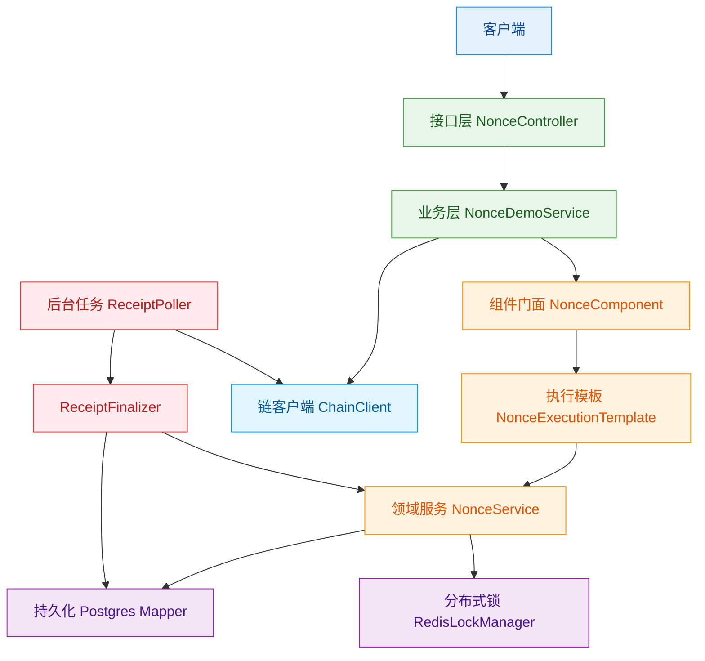
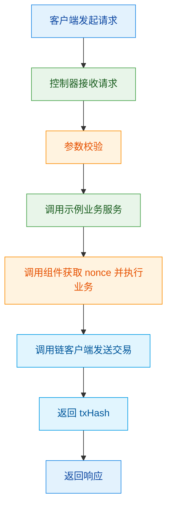
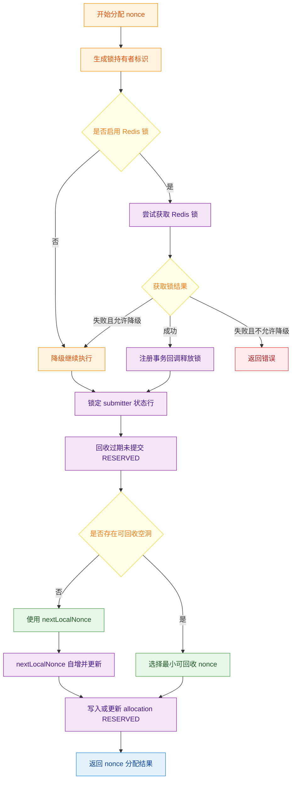
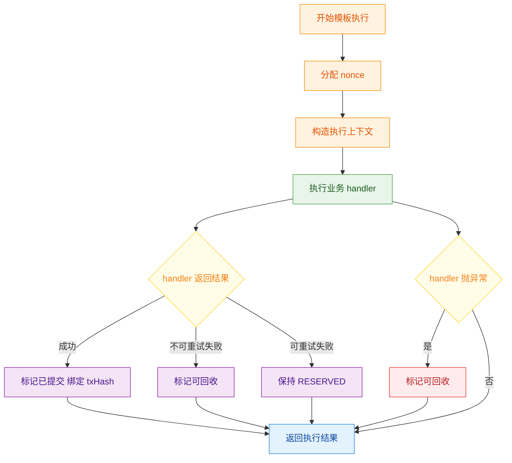
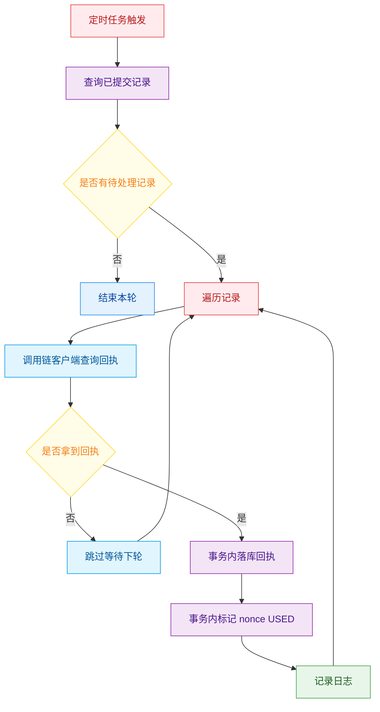
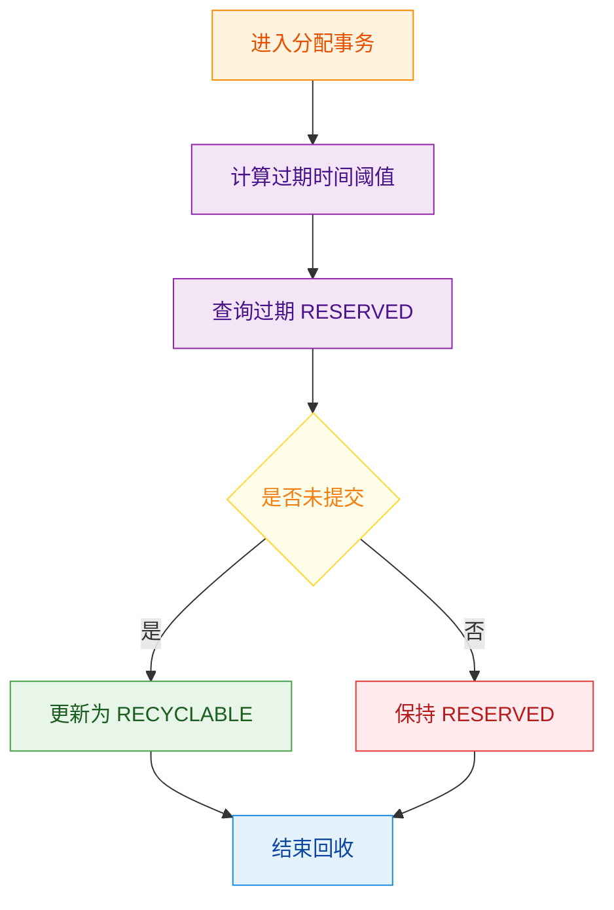

## 产品设计

### 1 产品定位

本项目提供一个可复用的 nonce 管理组件 并附带一个可运行的 Spring Boot demo
目标是在多实例并发场景下为每个 submitter 生成连续 nonce 并提供可回收空洞能力
同时用 receipt 驱动 nonce 终态 避免仅凭 txHash 误判链上消耗

### 2 目标与非目标

- **目标**
  - 为每个 submitter 分配连续递增 nonce
  - 支持并发 多 submitter 并行 同 submitter 串行
  - 支持空洞复用 将可回收 nonce 重新分配
  - 支持 Redis 可选加速 Redis 失败可降级
  - 支持 receipt 驱动 USED 让 nonce 终态与链消耗对齐
  - 提供最小 REST API 便于验证与演示

- **非目标**
  - 不实现完整的 confirmations finality 统计与 reorg 处理
  - 不实现真实链节点的 RPC SDK 适配 demo 内使用 MockChainClient

### 3 使用者与角色

- **业务调用方**: 通过 HTTP API 或直接依赖 `NonceComponent` 获取 nonce 并发交易
- **组件开发者**: 维护 core 包 提供稳定接口与一致性语义
- **运维与平台**: 提供 Postgres Redis 并设置合适的连接池与超时
- **链节点或链网关**: 提供发送交易与查询 receipt 的能力

### 4 总体架构

#### 4.1 分层结构

- **接口层 demo**
  - `NonceController` 提供 REST API
  - `NonceDemoService` 作为示例业务
  - `MockChainClient` 作为示例链客户端

- **核心组件 core**
  - `NonceComponent` 门面
  - `NonceExecutionTemplate` 执行模板
  - `NonceService` 领域服务
  - `NonceRepository` 持久化抽象
  - `RedisLockManager` 分布式锁抽象

- **基础设施**
  - Postgres MyBatisPlus Mapper 注解 SQL
  - Redis StringRedisTemplate
  - Spring 事务与调度

#### 4.2 架构图

### 5 核心概念与状态语义

#### 5.1 submitter

submitter 表示一个需要独立 nonce 序列的业务主体
例如 钱包地址 用户账户或业务分片键

#### 5.2 nonce 分配记录

每条 submitter nonce 有一条 allocation 记录
该记录用于保证不重复分配 并表达生命周期

#### 5.3 allocation 状态

- **RESERVED**: nonce 已分配但尚未确认链已消耗
- **USED**: receipt 已出现 nonce 已被链消耗 不等价于业务成功
- **RECYCLABLE**: nonce 可复用 只在确定不会被链消耗或业务明确放弃时进入

#### 5.4 txHash 与 receipt

- **txHash**: 代表提交后可定位交易 但不保证已被打包
- **receipt**: 代表交易已打包 只要 receipt 出现 nonce 即被链消耗

### 6 功能清单与说明

#### 6.1 REST API 演示接口

- **路径**: `POST /api/nonces/{submitter}`
- **请求体**: `payload`
- **响应**: `submitter nonce payload` 其中 payload 含 txHash 与 echo
- **目的**: 以最小调用面验证组件行为

#### 6.2 nonce 分配

- 输入 submitter
- 可选 Redis 锁减少热点 submitter DB 行锁竞争
- 在事务中锁定 submitter 状态行
- 回收过期未提交的 RESERVED
- 优先复用 RECYCLABLE 最小 nonce
- 否则使用 nextLocalNonce 并自增
- 以 RESERVED 返回给业务

#### 6.3 事务同步释放 Redis 锁

Redis 锁通过 `TransactionLockSynchronizer` 注册事务回调
在事务提交或回滚后释放 避免事务未提交时锁提前释放导致并发穿透

#### 6.4 空洞复用

当 nonce 进入 RECYCLABLE 后
后续分配会优先取最小可回收 nonce 以填补空洞

#### 6.5 receipt 驱动 USED

业务 handler 只需要返回 SUCCESS 并提供 txHash
模板不会立刻将 nonce 标记 USED
而是先 `markSubmitted` 绑定 txHash 并保持 RESERVED
后台 `ReceiptPoller` 轮询 `ChainClient.getTransactionReceipt`
一旦 receipt 出现 再 markUsed 并可选落库 receipt

#### 6.6 receipt 持久化

通过 `tx_receipts` 表保存 receipt 基本信息
用于审计 对账 与未来 confirmations 扩展
若表未创建 会自动降级为只 markUsed 并记录日志

### 7 关键流程图

#### 7.1 HTTP 请求到返回

#### 7.2 nonce 分配流程

#### 7.3 模板执行与状态流转

#### 7.4 receipt 驱动 USED 闭环

#### 7.5 过期回收策略

### 8 数据模型设计

#### 8.1 submitter_nonce_state

- submitter
- lastChainNonce
- nextLocalNonce
- updatedAt
- createdAt

用途
用于记录每个 submitter 的本地 nonce 游标 nextLocalNonce
lastChainNonce 预留用于未来与链对账与 finality 推进

#### 8.2 submitter_nonce_allocation

- id
- submitter
- nonce
- status
- lockOwner
- lockedUntil
- txHash
- reason
- updatedAt
- createdAt

关键约束与查询
- submitter nonce 唯一约束 用于防重分配
- 按 submitter status nonce 查询 用于空洞复用与回收
- 按 status txHash 查询 用于 receipt 轮询

#### 8.3 tx_receipts

- txHash 主键
- submitter
- nonce
- blockNumber
- blockHash
- success
- updatedAt
- createdAt

用途
用于审计查询 对账与未来 confirmations 计算

### 9 关键配置项

来自 `application.yml` 与 `NonceProperties`

- `nonce.redis-enabled`
- `nonce.lock-ttl`
- `nonce.reserved-timeout`
- `nonce.degrade-on-redis-failure`
- `nonce.receipt-poll-interval`
- `nonce.receipt-poll-batch-size`

### 10 一致性与并发保证

#### 10.1 同 submitter 串行化

- Redis 锁可选 用于减少热点行锁竞争
- Postgres `SELECT FOR UPDATE` 锁定 submitter 状态行
- allocation 表通过唯一约束与 `ON CONFLICT` 保证不重复分配

#### 10.2 事务边界

- `NonceService.allocate` 在事务内完成
  - 锁定状态
  - 回收
  - 选择 nonce
  - reserve
- Redis 锁在事务完成后释放

#### 10.3 receipt 驱动终态

- `markSubmitted` 只绑定 txHash 不改变状态为 USED
- `ReceiptFinalizer` 在事务内落库 receipt 并 markUsed
- 避免仅凭 txHash 误判链已消耗

### 11 失败处理策略

- **不可重试失败**: 立即 markRecyclable
- **可重试失败**: 保持 RESERVED 由业务自行重试
- **异常**: 默认 markRecyclable 避免 nonce 泄漏
- **receipt 表不存在**: 降级不阻塞 只 markUsed 并记录日志

### 12 可扩展设计

#### 12.1 confirmations 与 finality

当前只实现 receipt 驱动 USED
后续可引入新区块监听与确认数统计
并将 lastChainNonce 在达到确认阈值后推进

建议扩展点
- 新增 BlockListener 负责新区块事件
- 新增 ConfirmationManager 维护 pending 并按 parentHash 递推
- 新增 tx_confirmations 表持久化确认链

