# Nonce 管理系统架构演进对比

> 从单节点到分布式、从分配到终局的完整演进路线图

---

## 一、当前架构 vs 目标架构

### 1.1 当前架构（V1.0）

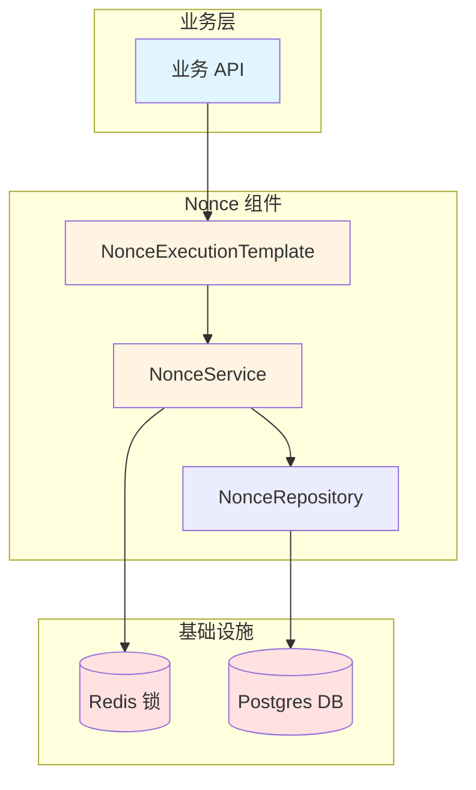

**特点**：
- ✅ 单节点内并发控制良好
- ✅ Redis 锁 + DB 行锁保证一致性
- ❌ 无分布式协调，多节点会冲突
- ❌ 分配后不知道交易终局
- ❌ 未对齐链上 nonce

---

### 1.2 目标架构（V2.0）

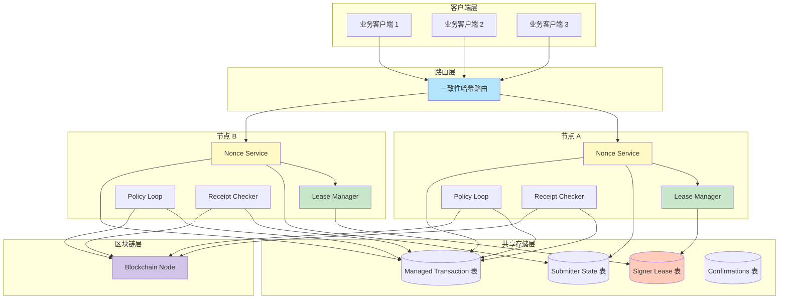

**特点**：
- ✅ 多节点高可用
- ✅ 分布式租约 + fencing 防止脑裂
- ✅ 路由优化，性能提升
- ✅ 完整的终局跟踪
- ✅ 对齐链上 nonce

---

## 二、核心模块演进对比

### 2.1 Nonce 分配模块

#### 当前实现（V1.0）

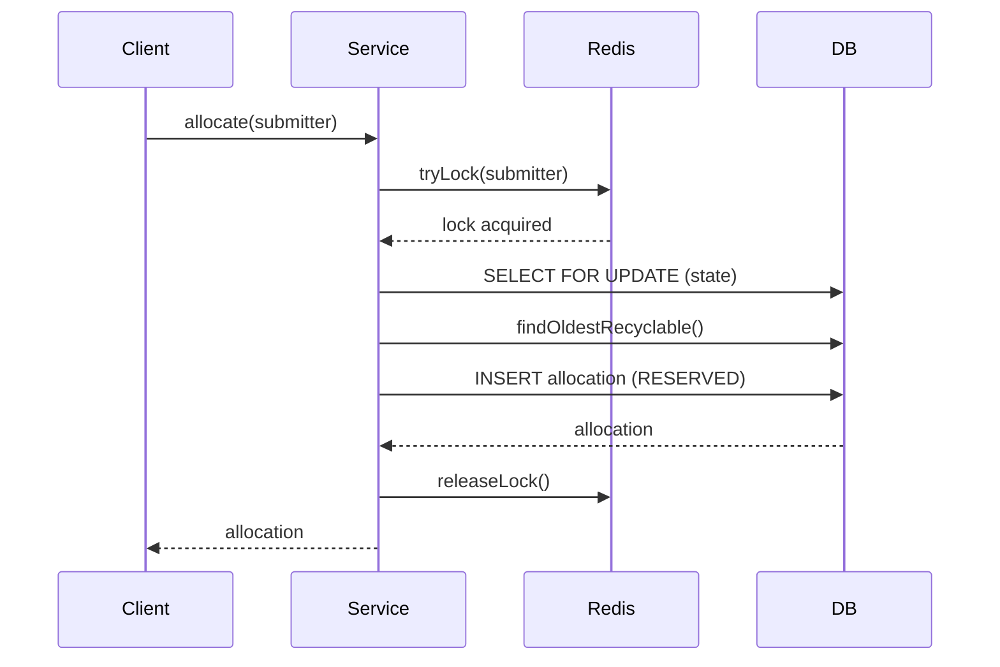

**问题**：
- 未查询链上 nonce（可能分配已被链上使用的 nonce）
- 无缓存机制（每次都查 DB）
- 无 fencing token（多节点竞态）

---

#### 目标实现（V2.0）

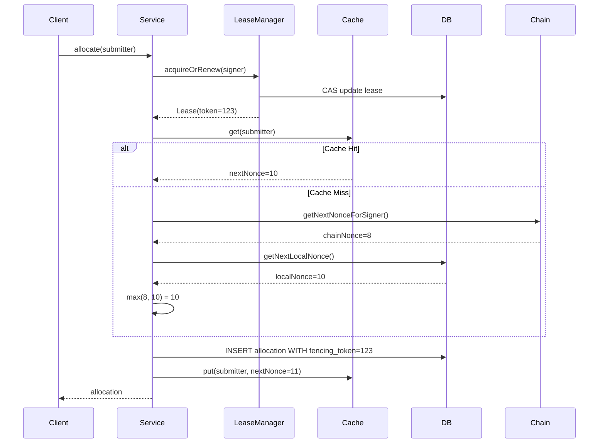

**改进**：
- ✅ 租约保证单主
- ✅ 三级决策：max(chain, cache, db)
- ✅ 缓存加速
- ✅ Fencing token 防止旧节点写入

---

### 2.2 交易生命周期管理

#### 当前实现（V1.0）

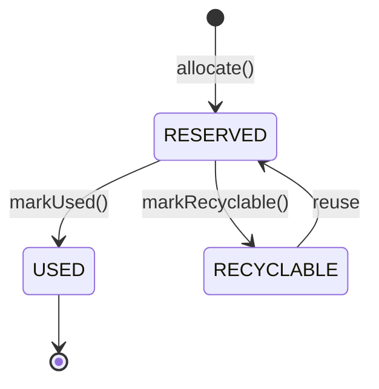

**问题**：
- 只有 nonce 状态，没有交易记录
- 不知道交易是否真正上链
- 无法跟踪终局确认

---

#### 目标实现（V2.0）

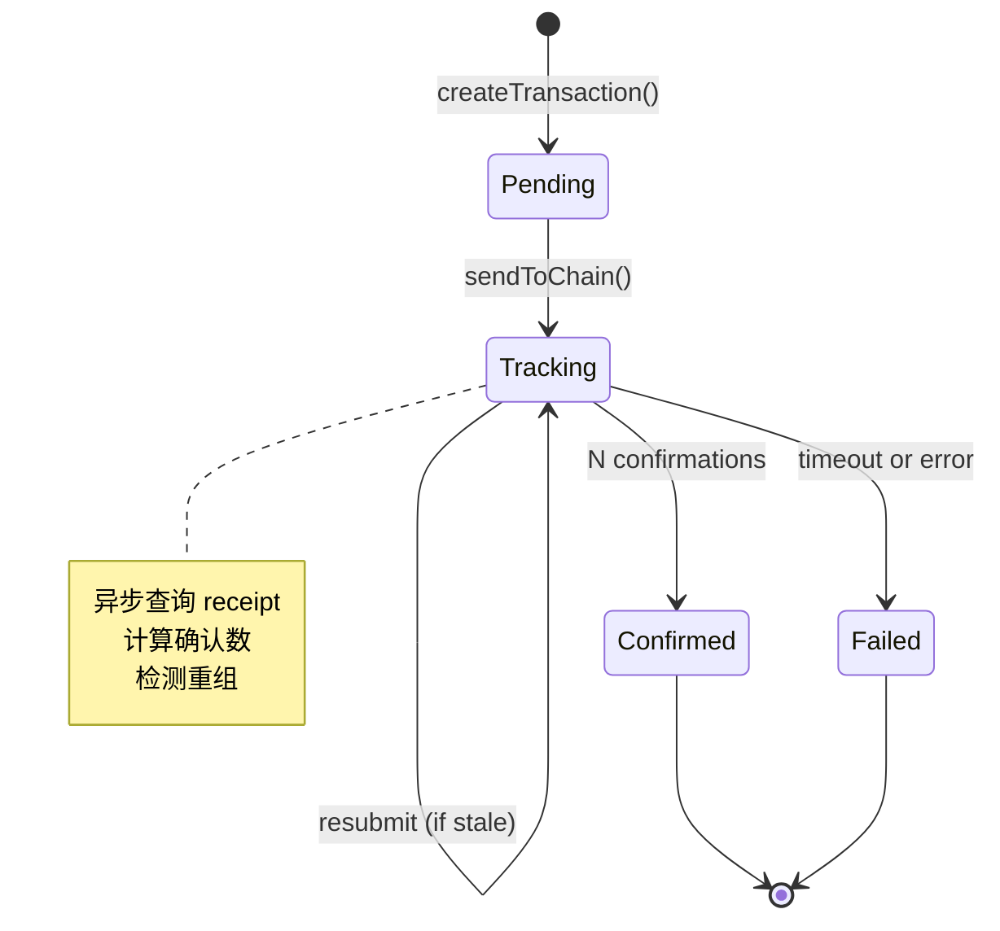

**改进**：
- ✅ 完整的交易记录（ManagedTransaction）
- ✅ 状态机更细化（Pending/Tracking/Confirmed/Failed）
- ✅ 异步终局跟踪
- ✅ 自动 resubmit

---

### 2.3 终局确认系统（新增）

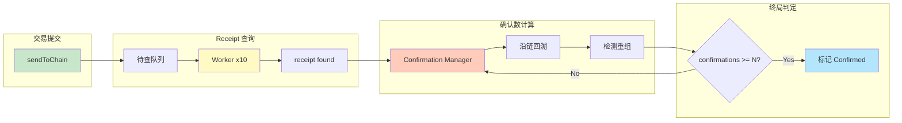

---

## 三、关键流程对比

### 3.1 并发控制机制

#### V1.0：单节点 Redis 锁

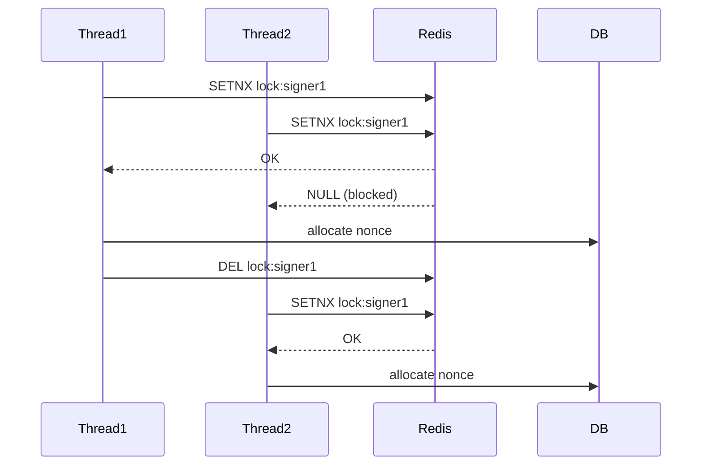

**问题**：
- 只能在单节点内串行
- 多节点时 Redis 锁无法防止脑裂

---

#### V2.0：分布式租约 + Fencing Token

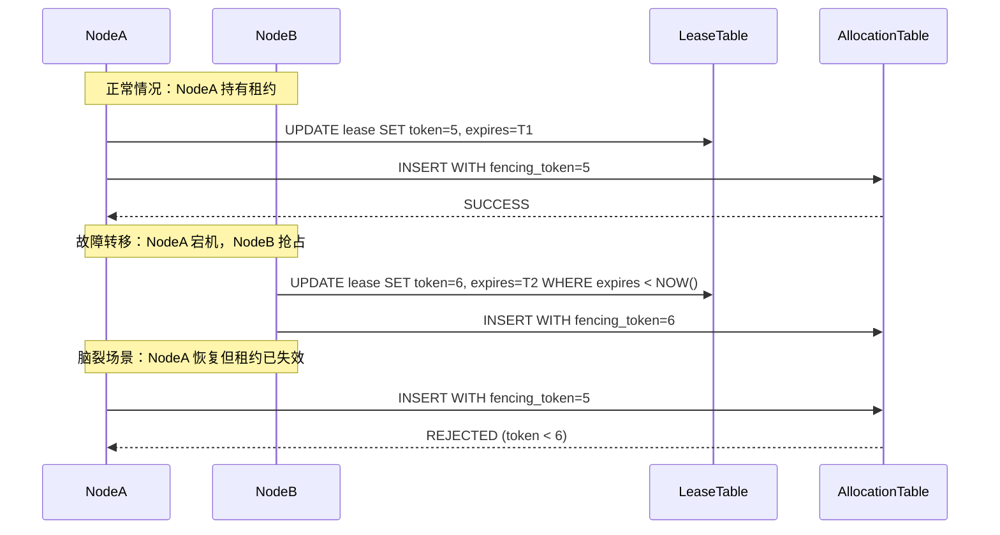

**改进**：
- ✅ CAS 更新租约，原子操作
- ✅ Fencing token 单调递增
- ✅ 旧 token 写入被数据库拒绝

---

### 3.2 Nonce 分配决策

#### V1.0：仅本地决策

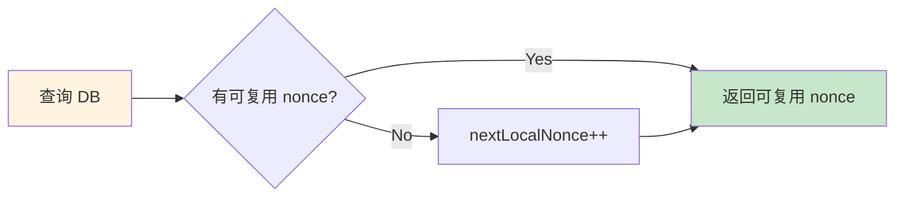

**问题**：
- 未查询链上，可能分配已被外部系统使用的 nonce
- 灾难恢复时无法自动对齐

---

#### V2.0：三级决策

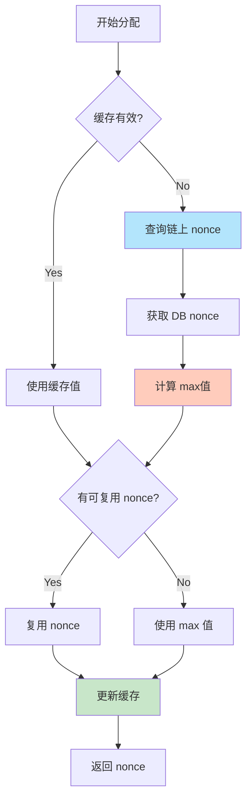

**改进**：
- ✅ 链上优先：防止冲突
- ✅ 缓存加速：减少链查询
- ✅ DB 兜底：缓存失效时使用
- ✅ 自动对齐：灾难恢复时从链上重建

---

### 3.3 重组处理（新增能力）

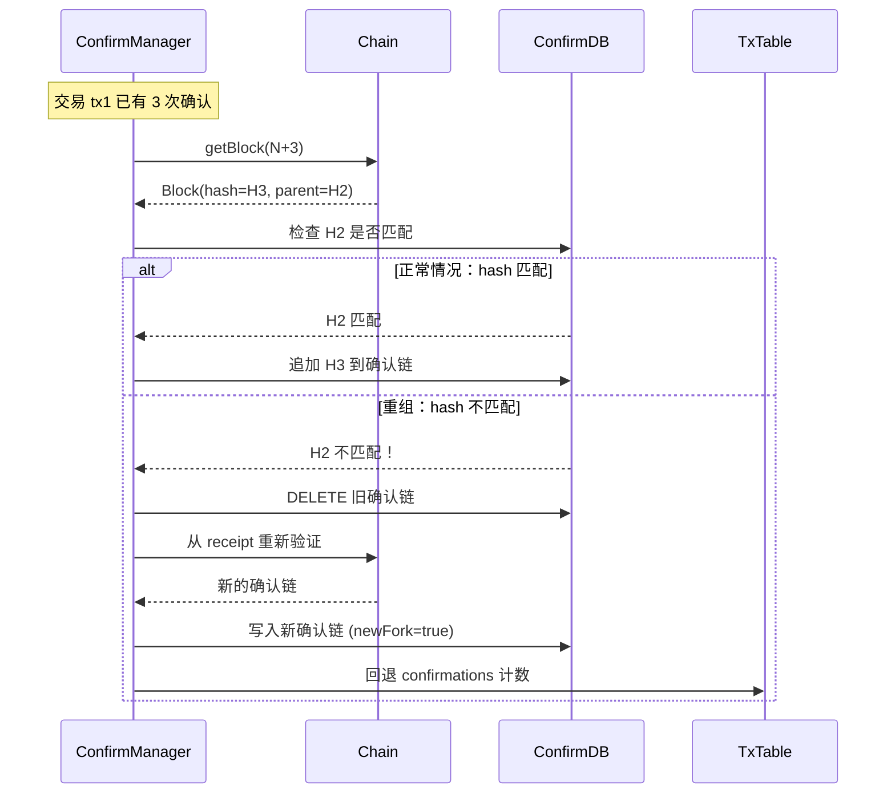

**特点**：
- ✅ 检测到重组时清空旧确认链
- ✅ newFork=true 通知下游全量覆盖
- ✅ 从 receipt 所在块重新验证
- ✅ 确认数可能回退（避免过早终局）

---

## 四、数据模型演进

### 4.1 V1.0 数据模型

```
submitter_nonce_state (submitter 状态)
├── submitter (PK)
├── last_chain_nonce (未使用)
├── next_local_nonce
└── updated_at

submitter_nonce_allocation (nonce 分配记录)
├── id (PK)
├── submitter
├── nonce (UNIQUE with submitter)
├── status (RESERVED/USED/RECYCLABLE)
├── lock_owner
├── locked_until
├── tx_hash
└── updated_at
```

**问题**：
- `last_chain_nonce` 字段存在但未使用
- 没有 `request_id`（无幂等去重）
- 没有 `fencing_token`（无分布式保护）
- 没有交易状态追踪

---

### 4.2 V2.0 数据模型

```
signer_lease (分布式租约) ★ NEW
├── signer (PK)
├── owner_node
├── fencing_token (单调递增)
├── acquired_at
├── expires_at
└── updated_at

submitter_nonce_state (submitter 状态)
├── submitter (PK)
├── last_chain_nonce ★ 现在真正使用
├── next_local_nonce
└── updated_at

managed_transaction (交易记录) ★ NEW
├── id (PK)
├── submitter
├── nonce (UNIQUE with submitter)
├── tx_hash
├── request_id (UNIQUE, 幂等去重) ★ NEW
├── status (Pending/Tracking/Confirmed/Failed)
├── sub_status (Stale/Timeout)
├── first_submit_at
├── last_submit_at
├── confirmed_at
├── confirmations (当前确认数)
├── receipt_block_number
├── receipt_block_hash
├── error_message
├── fencing_token ★ NEW
├── created_at
└── updated_at

transaction_confirmations (确认链) ★ NEW
├── tx_id (FK)
├── block_number (PK with tx_id)
├── block_hash
├── parent_hash
└── created_at
```

**改进**：
- ✅ 新增租约表，支持分布式协调
- ✅ 新增交易表，替代简单的 allocation
- ✅ 新增确认链表，支持重组检测
- ✅ 所有关键写操作带 fencing_token
- ✅ request_id 支持幂等

---

## 五、性能对比

### 5.1 吞吐量对比

| 场景 | V1.0 | V2.0 | 提升 |
|------|------|------|------|
| 单 signer 串行分配 | 200 TPS | 1000+ TPS | **5x** |
| 多 signer 并发分配 | 1000 TPS | 5000+ TPS | **5x** |
| 批处理模式（V2.0） | - | 10000+ TPS | **50x** |

**原因**：
- 缓存减少 DB 查询
- 批处理减少事务次数
- 路由减少锁竞争

---

### 5.2 延迟对比

| 指标 | V1.0 | V2.0 | 改进 |
|------|------|------|------|
| 分配延迟 P50 | 50ms | 20ms | ↓ 60% |
| 分配延迟 P99 | 200ms | 100ms | ↓ 50% |
| 终局确认延迟 | N/A | 30-60s | **新增** |

---

### 5.3 可用性对比

| 能力 | V1.0 | V2.0 |
|------|------|------|
| 单节点故障 | ❌ 服务不可用 | ✅ 自动切换 |
| 脑裂保护 | ❌ 无保护 | ✅ Fencing token |
| 链上对齐 | ❌ 手动修复 | ✅ 自动对账 |
| 重组处理 | ❌ 不感知 | ✅ 自动回退 |
| 灾难恢复 | ⚠️ 部分支持 | ✅ 完全自动化 |

---

## 六、迁移路径

### 6.1 数据迁移

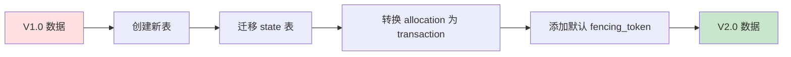

**迁移脚本**：

```sql
-- 1. 创建新表（signer_lease, managed_transaction, transaction_confirmations）
CREATE TABLE signer_lease ...;
CREATE TABLE managed_transaction ...;
CREATE TABLE transaction_confirmations ...;

-- 2. 迁移现有 allocation 为 transaction
INSERT INTO managed_transaction (id, submitter, nonce, tx_hash, status, fencing_token, ...)
SELECT 
    gen_random_uuid(), 
    submitter, 
    nonce, 
    tx_hash,
    CASE status
        WHEN 'RESERVED' THEN 'Pending'
        WHEN 'USED' THEN 'Confirmed'
        ELSE 'Failed'
    END,
    0,  -- 默认 fencing_token
    ...
FROM submitter_nonce_allocation;

-- 3. 保留旧表（灰度期间共存）
-- 待验证无误后再删除
```

---

### 6.2 灰度发布

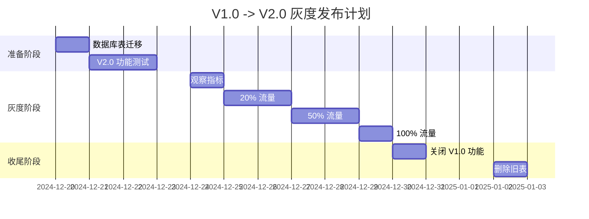

**灰度策略**：
1. 按 submitter 维度灰度（哈希分流）
2. 关键指标：错误率、延迟、吞吐量
3. 出现问题立即回滚

---

### 6.3 回滚方案

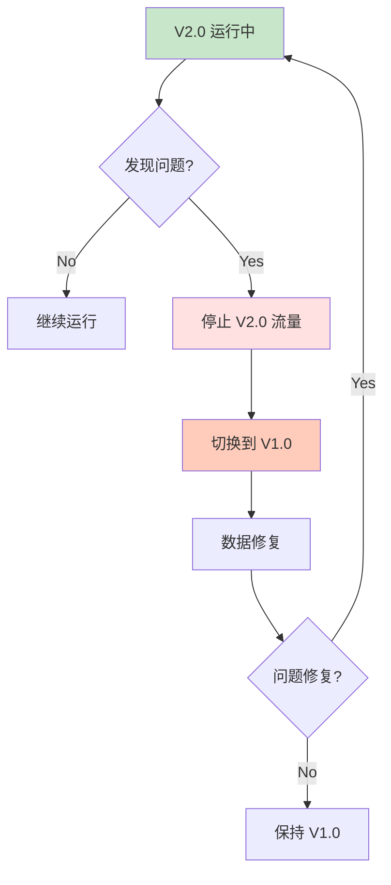

**回滚检查清单**：
- [ ] V1.0 代码仍然部署（灰度期间）
- [ ] 旧表未删除（可回退）
- [ ] 监控告警正常
- [ ] 回滚脚本已准备

---

## 七、总结

### 7.1 架构演进核心要点

| 维度 | V1.0 | V2.0 |
|------|------|------|
| **并发控制** | Redis 锁 | 分布式租约 + Fencing |
| **Nonce 决策** | 仅本地 DB | max(chain, cache, db) |
| **状态管理** | RESERVED/USED/RECYCLABLE | Pending/Tracking/Confirmed/Failed |
| **终局跟踪** | ❌ 无 | ✅ Receipt + Confirmations + Reorg |
| **幂等性** | ⚠️ 部分 | ✅ Request ID + Known TX |
| **可用性** | 单节点 | 多节点高可用 |
| **可观测性** | ⚠️ 基础 | ✅ 完善（监控+对账+告警） |

---

### 7.2 对齐 FireFly 的核心方法论

| FireFly 方法论 | 我们的实现 |
|---------------|-----------|
| 按 signer 串行化 | ✅ 租约 + fencing |
| 三级决策 max(chain, cache, db) | ✅ 完全实现 |
| 交易即 nonce 索引 | ✅ ManagedTransaction |
| Receipt 异步拉取 | ✅ Receipt Checker |
| 确认数 + 重组检测 | ✅ Confirmation Manager |
| Resubmit 机制 | ✅ Policy Loop |
| 幂等处理 | ✅ Request ID + Known TX |
| Batch Writer | ✅ Batch Writer 模式 |

---

### 7.3 演进路线图

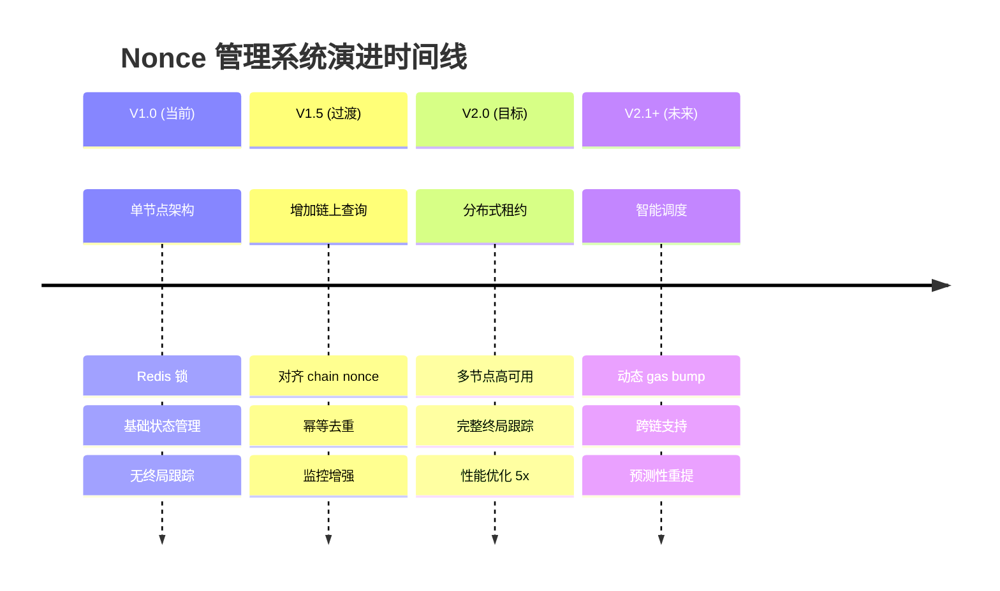

---

**下一步行动**：参考《项目演进计划.md》和《任务清单.md》开始具体实施。

