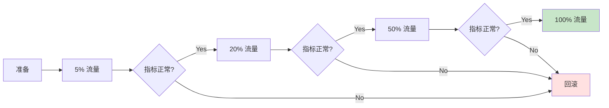

# Nonce 管理系统演进指南 - 总览

> 🎯 从单节点到分布式、从分配到终局的完整演进方案

---

## 📚 文档导航

### 核心文档（按阅读顺序）

1. **[架构演进对比.md](./架构演进对比.md)** ⭐ 推荐先读
   - 📊 可视化对比当前架构 vs 目标架构
   - 🎨 Mermaid 图表展示核心流程变化
   - 📈 性能、可用性对比表格
   - 🗺️ 迁移路径和灰度方案

2. **[项目演进计划.md](./项目演进计划.md)** ⭐ 详细实施方案
   - 📝 21 个独立任务的详细设计
   - 💻 SQL、Java 代码示例
   - ✅ 验收标准和测试用例
   - 🔧 配置项和参数说明

3. **[任务清单.md](./任务清单.md)** ⭐ 进度跟踪
   - ✔️ 任务状态跟踪表
   - 📅 迭代计划和里程碑
   - 📊 统计仪表板
   - ⚠️ 风险与依赖

### 参考文档

4. **[草稿1.md](./草稿1.md)**
   - FireFly Transaction Manager 方案研究
   - 分布式租约 + fencing 理论基础

5. **[README.md](./README.md)**
   - 当前系统（V1.0）的设计文档

---

## 🚀 快速开始

### 第一步：理解现状和目标

```bash
# 阅读架构对比文档（15 分钟）
cat 架构演进对比.md
```

**关键问题自查**：
- ✅ 我理解了当前架构的主要问题是什么吗？
- ✅ 我知道目标架构要解决哪些核心问题吗？
- ✅ 我清楚演进分为几个阶段吗？

---

### 第二步：选择起点任务

根据您的角色和需求，选择不同的起点：

#### 场景 A：我需要立即解决多节点冲突问题 🔥

**推荐路径**：
1. 任务 1.1 → 1.2：分布式租约 + fencing（P0，必须）
2. 任务 2.1 → 2.2：对齐链上 nonce（P0，必须）

**预期收益**：
- ✅ 多节点环境下 nonce 分配不冲突
- ✅ 防止脑裂导致的重复分配
- ✅ 本地与链上保持一致

**工作量**：5-7 天（单人）

---

#### 场景 B：我需要知道交易是否真正上链 📊

**推荐路径**：
1. 任务 3.1：交易记录表（P0，必须）
2. 任务 3.2 → 3.3：Receipt Checker + 确认数管理（P0，必须）

**预期收益**：
- ✅ 交易从分配到终局全流程可见
- ✅ 自动查询 receipt 和确认数
- ✅ 支持重组检测和回退

**工作量**：8-11 天（单人）

---

#### 场景 C：我需要提升系统性能 ⚡

**推荐路径**：
1. 任务 2.2：三级决策（缓存加速，P0）
2. 任务 2.3：Batch Writer 模式（P1，重要）
3. 任务 1.3：一致性哈希路由（P1，可选）

**预期收益**：
- ✅ 吞吐量提升 3-5 倍
- ✅ 延迟降低 50%+
- ✅ 减少数据库压力

**工作量**：9-13 天（单人）

---

#### 场景 D：我需要完整的终局管理系统 🎯

**推荐路径**：按《任务清单.md》中的迭代顺序执行

1. **第一轮迭代**（Week 1-3）：分布式协调基础
2. **第二轮迭代**（Week 4-7）：终局跟踪系统
3. **第三轮迭代**（Week 8-9）：性能优化
4. **第四轮迭代**（Week 10-11）：监控运维

**预期收益**：
- ✅ 对齐 FireFly 的完整能力
- ✅ 生产级别的高可用系统
- ✅ 完善的监控运维体系

**工作量**：8-10 周（2-3 人月）

---

### 第三步：执行任务

#### 3.1 开发流程（以任务 1.1 为例）

```bash
# 1. 创建分支
git checkout -b feat/task-1.1-signer-lease

# 2. 阅读详细设计
# 打开《项目演进计划.md》找到"任务 1.1"章节

# 3. 数据库变更
cd src/main/resources/db/migration
# 创建 V2__create_signer_lease_table.sql

# 4. 实现代码
# 参考计划中的代码示例，实现 SignerLeaseManager

# 5. 编写测试
# 按照验收标准编写单元测试和集成测试

# 6. 更新任务清单
# 在《任务清单.md》中将任务状态改为 "🔄 进行中"

# 7. 代码审查
git push origin feat/task-1.1-signer-lease
# 提交 PR

# 8. 合并后更新任务清单
# 将任务状态改为 "✅ 已完成"
```

---

#### 3.2 测试检查清单

每个任务完成后，必须通过以下测试：

**单元测试**：
- [ ] 核心逻辑覆盖率 > 90%
- [ ] 边界条件测试（null、空、异常）
- [ ] 并发场景测试

**集成测试**：
- [ ] 数据库事务正确性
- [ ] 分布式场景测试（多节点）
- [ ] 故障恢复测试

**性能测试**：
- [ ] 基准测试（对比优化前后）
- [ ] 压力测试（吞吐量、延迟）

**回归测试**：
- [ ] 现有功能不受影响
- [ ] API 兼容性保持

---

### 第四步：上线和验证

#### 4.1 灰度发布



**关键指标监控**：
- 错误率：< 0.1%
- 延迟 P99：< 500ms
- 吞吐量：不低于基准
- Nonce 冲突数：= 0

---

#### 4.2 上线检查清单

**上线前**：
- [ ] 代码已审查并合并
- [ ] 所有测试通过
- [ ] 数据库迁移脚本已准备
- [ ] 配置项已更新
- [ ] 监控告警已配置
- [ ] 回滚方案已准备

**上线中**：
- [ ] 灰度流量逐步放开
- [ ] 实时监控关键指标
- [ ] 日志无异常报错
- [ ] 数据库连接池正常

**上线后**：
- [ ] 观察 24 小时无异常
- [ ] 业务侧验证功能正常
- [ ] 更新文档和 runbook
- [ ] 删除临时代码和配置

---

## 📊 进度跟踪

### 当前状态

**整体进度**：0 / 21 任务完成（0%）

**按优先级**：
- P0（必须）：0 / 11 完成
- P1（重要）：0 / 5 完成
- P2（次要）：0 / 5 完成

**按阶段**：
- 阶段 1（基础设施）：0 / 3 完成
- 阶段 2（Nonce 分配）：0 / 3 完成
- 阶段 3（终局确认）：0 / 5 完成
- 阶段 4（交易生命周期）：0 / 2 完成
- 阶段 5（幂等性）：0 / 3 完成
- 阶段 6（监控运维）：0 / 5 完成

---

### 里程碑计划

| 里程碑 | 预计完成时间 | 关键任务 | 状态 |
|--------|-------------|---------|------|
| M1：分布式协调基础 | Week 3 | 1.1, 1.2, 2.1, 2.2, 5.1 | ⬜️ 待开始 |
| M2：终局跟踪系统 | Week 7 | 3.1, 3.2, 3.3, 4.1, 5.3 | ⬜️ 待开始 |
| M3：性能优化 | Week 9 | 2.3, 3.4, 5.2, 1.3 | ⬜️ 待开始 |
| M4：监控运维 | Week 11 | 6.1, 6.2, 6.3 | ⬜️ 待开始 |

---

## 🎓 学习资源

### 核心概念理解

#### 1. 分布式租约（Distributed Lease）

**为什么需要？**
- 单节点锁（Redis SETNX）只能防止单节点内竞态
- 多节点环境下，网络分区或故障转移可能导致"双主"
- 租约 + fencing token 保证"同一时刻只有一个 leader"

**如何工作？**
```sql
-- 抢占或续租（原子操作）
UPDATE signer_lease 
SET owner_node = :nodeId, 
    fencing_token = fencing_token + 1, 
    expires_at = :newExpireTime
WHERE signer = :signer 
  AND (expires_at < NOW() OR owner_node = :nodeId);
```

**关键点**：
- CAS 更新：只有过期或当前持有者能更新
- Fencing token 单调递增：每次抢占 +1
- 所有写操作带 token 校验：旧 token 被拒绝

---

#### 2. 三级决策 max(chain, cache, db)

**为什么需要？**
- 链上是唯一真相，本地可能滞后
- 外部系统可能也在用同一 signer 发交易
- 灾难恢复时需要从链上重建状态

**决策流程**：
```
1. 查缓存（有效期 5 分钟）
   └─ 命中 → 使用缓存值
   └─ 未命中 → 查链上

2. 查链上（实时）
   └─ 得到 chainNonce

3. 查 DB（持久化）
   └─ 得到 localNonce

4. 取最大值
   └─ targetNonce = max(chainNonce, localNonce)

5. 更新缓存和 DB
```

**关键点**：
- 链上优先：防止冲突
- 缓存加速：减少链查询（性能）
- DB 兜底：缓存失效时使用

---

#### 3. 重组检测（Reorg Detection）

**为什么需要？**
- PoW/PoS 链可能发生分叉和重组
- 交易的确认数可能"回退"
- 过早判定终局会导致业务错误

**检测方法**：
```
对于每个新块 N：
1. 检查 parentHash 是否匹配上一个块
2. 如果不匹配 → 检测到重组
3. 裁剪从分叉点之后的所有确认
4. 用新分叉重新计算确认数
```

**关键点**：
- 维护完整的确认链（block_number, block_hash, parent_hash）
- newFork=true 通知下游全量覆盖
- 确认数可能减少（从 5 回退到 2）

---

### 参考链接

**FireFly Transaction Manager**：
- GitHub: https://github.com/hyperledger/firefly-transaction-manager
- 文档: https://hyperledger.github.io/firefly-transaction-manager/

**相关论文**：
- [Fencing Tokens for Distributed Locks](https://martin.kleppmann.com/2016/02/08/how-to-do-distributed-locking.html)
- [Blockchain Reorganization](https://en.bitcoin.it/wiki/Chain_Reorganization)

**技术博客**：
- [分布式系统中的 Fencing Token](https://martin.kleppmann.com/)
- [以太坊 Nonce 管理最佳实践](https://ethereum.org/en/developers/docs/)

---

## 🛠️ 常见问题 (FAQ)

### Q1：我必须按顺序完成所有任务吗？

**A**：不必须，但建议遵循依赖关系：

**必须先做的（依赖）**：
- 任务 1.1 必须在 1.2 之前（租约是 fencing 的基础）
- 任务 3.1 必须在 3.2、3.3 之前（交易表是后续功能的基础）
- 任务 2.1 必须在 2.2 之前（链查询是三级决策的前提）

**可以并行的**：
- 阶段 2（Nonce 分配）和阶段 5（幂等性）可以部分并行
- 阶段 6（监控运维）可以独立推进

---

### Q2：如果只想解决"多节点冲突"，需要做哪些任务？

**A**：最小集合（P0 任务）：

1. 任务 1.1：Signer 租约表（2-3 天）
2. 任务 1.2：Fencing Token 校验（3-4 天）
3. 任务 2.1 + 2.2：对齐链上 nonce（5-6 天）

**总计**：10-13 天（单人）

这些任务完成后，可以保证：
- ✅ 多节点环境下 nonce 不冲突
- ✅ 防止脑裂
- ✅ 本地与链上一致

---

### Q3：性能优化（任务 2.3）一定要做吗？

**A**：取决于您的场景：

**必须做**（如果）：
- 单 signer TPS > 100
- 有热点 signer（某个地址高频使用）
- 对延迟敏感（P99 < 100ms）

**可以不做**（如果）：
- 总 TPS < 100
- signer 数量多、分散
- 延迟要求不高（P99 < 500ms 可接受）

**建议**：先完成 P0 任务，上线观察性能，再决定是否做批处理优化。

---

### Q4：现有系统如何平滑迁移到新架构？

**A**：灰度发布 + 双写策略：

**阶段 1：数据迁移（停机窗口，5 分钟）**
```sql
-- 创建新表
CREATE TABLE signer_lease ...;
CREATE TABLE managed_transaction ...;

-- 迁移现有数据
INSERT INTO managed_transaction 
SELECT ... FROM submitter_nonce_allocation;
```

**阶段 2：双写（灰度期间，1-2 周）**
```java
// 同时写旧表和新表
allocationRepository.save(allocation);  // 旧
txRepository.save(transaction);         // 新
```

**阶段 3：切读（逐步放量）**
```java
if (grayRatio > random()) {
    return txRepository.findById(id);  // 读新表
} else {
    return allocationRepository.findById(id);  // 读旧表
}
```

**阶段 4：清理（验证无误后）**
```sql
-- 删除旧表
DROP TABLE submitter_nonce_allocation;
```

---

### Q5：如果任务执行中遇到问题怎么办？

**A**：问题排查流程：

1. **检查验收标准**：是否所有测试都通过？
2. **查看日志**：有无异常报错？
3. **对比文档**：实现是否与计划一致？
4. **降级回退**：如果影响生产，立即回滚

**获取帮助**：
- 查看《项目演进计划.md》中的详细设计
- 查看 FireFly 源码实现
- 在项目 Issue 中提问

---

## ✅ 验收标准

### 阶段 1 验收（分布式协调基础）

**功能验收**：
- [ ] 多节点并发分配 nonce，无冲突
- [ ] 节点 A 持有 lease，节点 B 抢占失败
- [ ] lease 过期后，节点 B 可以抢占
- [ ] 脑裂时旧节点写入被拒绝

**性能验收**：
- [ ] 分配延迟 P99 < 500ms
- [ ] lease 抢占成功率 > 99%

**测试覆盖**：
- [ ] SignerLeaseManager 单元测试覆盖率 > 90%
- [ ] 并发抢占集成测试通过

---

### 阶段 2 验收（终局跟踪系统）

**功能验收**：
- [ ] 交易从 Pending → Tracking → Confirmed 全流程可追踪
- [ ] receipt 异步查询不阻塞主路径
- [ ] 达到 20 次确认后自动标记终局
- [ ] 检测到重组时确认数正确回退

**性能验收**：
- [ ] 终局确认延迟平均 < 60s（20 次确认）
- [ ] receipt 查询 worker 利用率 > 80%

**测试覆盖**：
- [ ] ReceiptChecker 单元测试覆盖率 > 85%
- [ ] 重组检测集成测试通过

---

### 阶段 3 验收（性能优化）

**性能验收**：
- [ ] 吞吐量 > 1000 TPS（单 signer）
- [ ] 分配延迟 P99 < 200ms
- [ ] 批处理命中率 > 80%
- [ ] 缓存命中率 > 95%

**压力测试**：
- [ ] 100 并发持续 10 分钟无错误
- [ ] 内存使用稳定（无泄漏）
- [ ] CPU 使用率 < 80%

---

### 阶段 4 验收（监控运维）

**功能验收**：
- [ ] Prometheus 指标完整可采集
- [ ] Grafana 面板展示关键指标
- [ ] 对账自动运行并修复差异
- [ ] 告警正确触发（测试场景）

**运维验收**：
- [ ] 故障注入测试通过（节点宕机、网络分区）
- [ ] 灰度发布流程验证
- [ ] 回滚方案验证

---

## 📞 联系与支持

### 技术支持

- 项目负责人：[待填写]
- 技术顾问：[待填写]
- 问题反馈：[GitHub Issues 或内部系统]

### 会议安排

- 每周例会：[待定]
- 技术评审：重要任务开始前
- 代码审查：每个 PR 合并前

---

## 📝 版本历史

| 版本 | 日期 | 主要变更 | 作者 |
|------|------|---------|------|
| v1.0 | 2024-12-19 | 初始版本，完整的演进计划 | Assistant |

---

## 🎉 开始您的旅程！

选择一个起点，打开《项目演进计划.md》，开始第一个任务吧！

**记住**：
1. 🎯 明确目标：知道要解决什么问题
2. 📖 仔细阅读：理解设计和验收标准
3. ✅ 充分测试：每个任务都要有测试
4. 🔄 持续集成：小步快跑，频繁合并
5. 📊 关注指标：上线后观察关键指标

祝您演进顺利！🚀

