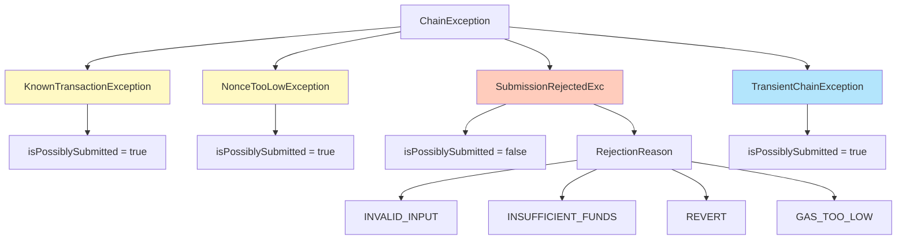
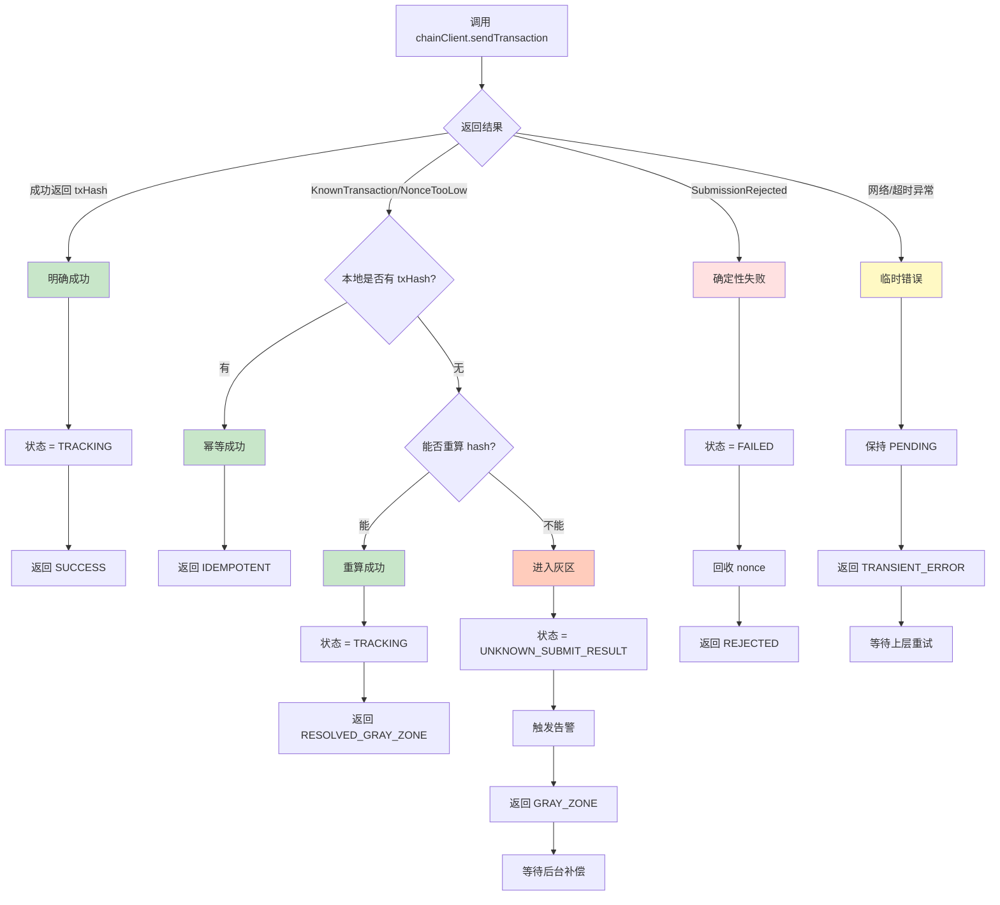
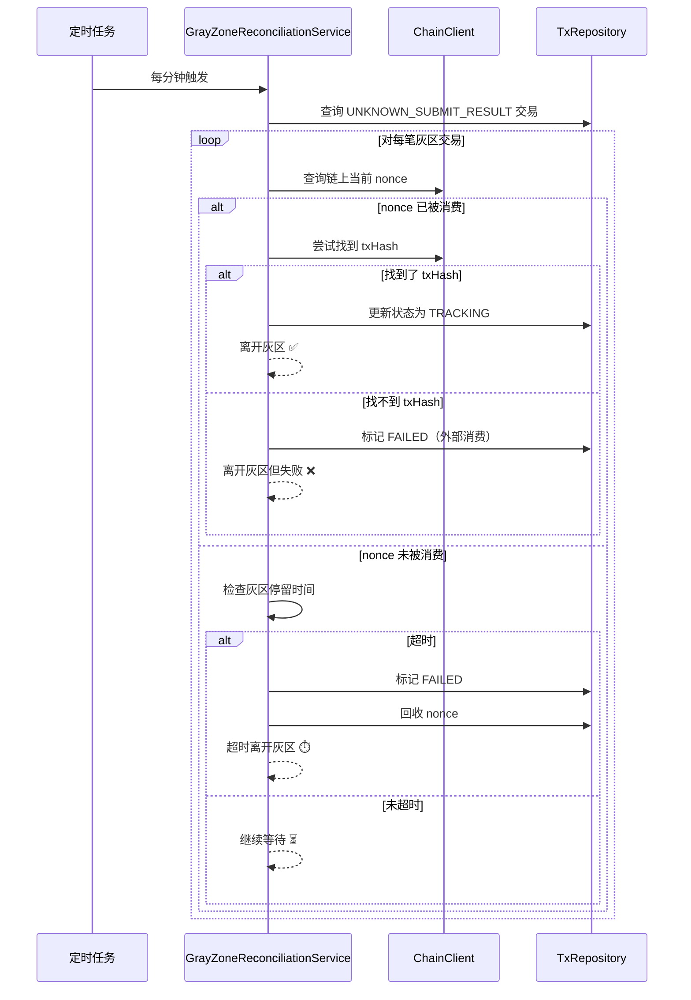

# 灰区策略优化说明

> 针对《项目演进计划.md》任务 5.2 的细化升级

---

## 🎯 优化背景

### 原方案的问题

**原设计（V1）**：
```
if (KnownTransactionException) {
    if (本地有 hash) {
        return 成功（幂等）
    } else {
        尝试重算 hash
        if (成功) return 成功
        else throw 异常
    }
}
```

**核心缺陷**：
1. ❌ 没有专门的"灰区"状态，只能 throw 异常
2. ❌ 灰区情况下直接失败，无法后续补偿
3. ❌ 异常类型不够细化，无法区分"确定失败"和"状态未知"
4. ❌ 缺少后台补偿机制

---

## ✨ 优化后的方案

### 1. 引入 UNKNOWN_SUBMIT_RESULT 状态

```java
public enum TransactionState {
    PENDING,                // 待提交
    TRACKING,               // 已提交，跟踪中
    CONFIRMED,              // 已终局确认
    FAILED,                 // 明确失败
    UNKNOWN_SUBMIT_RESULT   // ⭐ 新增：提交结果未知（灰区）
}
```

**意义**：
- ✅ 明确表示"交易可能已提交但本地无法确定"的状态
- ✅ 不会误判为失败导致 nonce 被错误回收
- ✅ 可以通过后台补偿机制逐步解决

---

### 2. 细化异常类型体系



**关键设计**：
- `isPossiblySubmitted()` 方法：判断该异常是否表示"可能已提交"
- 只有 `SubmissionRejectedExc` 返回 false（确定未提交，可回收 nonce）
- 其他异常都返回 true（保守处理，不回收 nonce）

---

### 3. 完整的决策树



---

### 4. 灰区补偿机制

#### 工作流程



#### 补偿策略

| 情况 | 链上 nonce | 链上是否有该 tx | 处理策略 | 最终状态 |
|------|-----------|---------------|---------|---------|
| A | > 本地 nonce | 找到了 txHash | 更新 txHash，状态改为 TRACKING | ✅ 离开灰区 |
| B | > 本地 nonce | 找不到 txHash | 标记 FAILED（外部消费） | ❌ 离开灰区但失败 |
| C | = 本地 nonce | - | 检查停留时间 | - |
| C1 | = 本地 nonce | - | 未超时，继续等待 | ⏳ 保持灰区 |
| C2 | = 本地 nonce | - | 超时，标记 FAILED 并回收 | ⏱️ 离开灰区 |

---

### 5. 关键代码片段对比

#### V1（原方案）：简单处理

```java
catch (KnownTransactionException e) {
    if (tx.getTxHash() != null) {
        // 幂等
        return success(tx.getTxHash());
    } else {
        // 灰区：尝试重算
        String hash = recompute();
        if (hash != null) {
            return success(hash);
        } else {
            throw new NonceException("无法确定 hash", e); // ❌ 直接失败
        }
    }
}
```

**问题**：无法区分"确定失败"和"状态未知"，灰区直接抛异常

---

#### V2（优化后）：细化处理

```java
catch (KnownTransactionException | NonceTooLowException e) {
    // 情况 A：本地有 hash → 幂等成功
    if (tx.getTxHash() != null) {
        return SubmissionResult.idempotent(tx.getTxHash());
    }
    
    // 情况 B：本地无 hash → 灰区
    String recomputedHash = chainClient.computeTransactionHash(request);
    
    if (recomputedHash != null) {
        // B1：重算成功 → 离开灰区
        tx.setTxHash(recomputedHash);
        tx.setState(TransactionState.TRACKING);
        return SubmissionResult.resolvedFromGrayZone(recomputedHash);
        
    } else {
        // B2：重算失败 → 进入灰区状态
        tx.setState(TransactionState.UNKNOWN_SUBMIT_RESULT);
        tx.setErrorReason("Gray zone: known tx but no local hash");
        
        alertService.sendAlert(...); // ✅ 告警但不失败
        
        return SubmissionResult.grayZone(e.getMessage());
    }
}
```

**改进**：
- ✅ 进入专门的灰区状态，而非失败
- ✅ 触发告警，通知运维
- ✅ 等待后台补偿机制处理

---

### 6. 监控指标增强

#### 新增指标

```java
// 成功类型细分
nonce_submission_success_total{type="direct"}            // 直接成功
nonce_submission_success_total{type="idempotent"}        // 幂等成功
nonce_submission_success_total{type="resolved_gray"}     // 从灰区恢复

// 灰区相关
nonce_gray_zone_entered_total                            // 进入灰区次数
nonce_gray_zone_resolved_total{method="found_hash"}      // 找到 hash 离开
nonce_gray_zone_resolved_total{method="timeout"}         // 超时离开
nonce_gray_zone_resolved_total{method="external_consumed"} // 外部消费
nonce_gray_zone_current_count                            // 当前灰区交易数

// 失败类型细分
nonce_submission_failed_total{reason="insufficient_funds"}
nonce_submission_failed_total{reason="revert"}
nonce_submission_failed_total{reason="gas_too_low"}

// 临时错误
nonce_submission_transient_error_total
```

#### Grafana 面板建议

```
Panel 1: 提交成功率
- Query: rate(nonce_submission_success_total[5m]) / rate(nonce_submission_total[5m])
- Alert: < 95%

Panel 2: 灰区交易趋势
- Query: nonce_gray_zone_current_count
- Alert: > 10

Panel 3: 灰区解决方式分布
- Query: rate(nonce_gray_zone_resolved_total[1h]) by (method)
- Type: Pie chart

Panel 4: 失败原因分布
- Query: rate(nonce_submission_failed_total[1h]) by (reason)
- Type: Bar chart
```

---

## 📊 优化效果对比

| 维度 | V1（原方案） | V2（优化后） | 提升 |
|------|------------|------------|------|
| **灰区处理** | ❌ 直接失败 | ✅ 专门状态 + 补偿 | **关键改进** |
| **异常分类** | 2 种（成功/失败） | 6 种（精细分类） | **3x 精细度** |
| **监控指标** | 基础计数 | 细分类型 + 灰区指标 | **10+ 新指标** |
| **nonce 安全** | ⚠️ 可能误回收 | ✅ 保守处理 | **更安全** |
| **可运维性** | ⚠️ 需人工排查 | ✅ 自动补偿 + 告警 | **自动化** |
| **代码复杂度** | 简单 | 中等 | **可接受** |

---

## 🚀 实施建议

### 阶段 1：基础异常体系（1 天）

```bash
# 创建异常类
src/main/java/com/work/nonce/core/exception/
├── KnownTransactionException.java
├── NonceTooLowException.java
├── SubmissionRejectedExc.java
└── TransientChainException.java

# 测试
- 单元测试：异常映射逻辑
- 集成测试：ChainClient 的错误处理
```

---

### 阶段 2：状态枚举与决策树（1 天）

```bash
# 修改状态枚举
src/main/java/com/work/nonce/core/model/
└── TransactionState.java  # 新增 UNKNOWN_SUBMIT_RESULT

# 实现决策树
src/main/java/com/work/nonce/core/service/
└── TransactionSubmissionService.java

# 测试
- 单元测试：各种情况的决策路径
- 集成测试：端到端提交流程
```

---

### 阶段 3：灰区补偿机制（2 天）

```bash
# 实现补偿服务
src/main/java/com/work/nonce/core/service/
└── GrayZoneReconciliationService.java

# 配置
src/main/resources/
└── application.yml  # 新增灰区配置项

# 测试
- 单元测试：补偿逻辑各分支
- 集成测试：灰区交易从进入到离开的完整流程
- 压力测试：大量灰区交易的性能
```

---

### 阶段 4：监控告警（1 天）

```bash
# 增加指标
src/main/java/com/work/nonce/core/metrics/
└── NonceSubmissionMetrics.java

# 告警配置
monitoring/
├── prometheus-rules.yml
└── grafana-dashboard.json

# 验证
- 触发灰区情况，检查告警是否正常
- 查看 Grafana 面板是否正常展示
```

---

## ✅ 验收清单

### 功能验收

- [ ] **幂等场景**：重复提交（本地有 hash）返回成功，不重复占 nonce
- [ ] **灰区进入**：KnownTransaction 且本地无 hash，状态变为 UNKNOWN_SUBMIT_RESULT
- [ ] **灰区离开-找到 hash**：补偿服务找到 txHash，状态变为 TRACKING
- [ ] **灰区离开-超时**：超时后标记 FAILED，nonce 被回收
- [ ] **灰区离开-外部消费**：nonce 被外部消费，标记 FAILED
- [ ] **确定性失败**：余额不足/revert 等，立即标记 FAILED 并回收 nonce
- [ ] **临时错误**：网络超时保持 PENDING，可重试

### 性能验收

- [ ] 灰区补偿不影响正常提交性能（< 5% 性能损失）
- [ ] 补偿扫描在 1000 笔灰区交易下完成时间 < 10s
- [ ] 监控指标采集不影响吞吐量

### 监控验收

- [ ] 进入灰区时告警正常触发
- [ ] Prometheus 指标正确记录各种情况
- [ ] Grafana 面板正常展示灰区趋势
- [ ] 灰区交易数量异常时告警

---

## 🎓 关键设计原则

### 1. 保守原则

```
宁可进入灰区等待补偿，也不误判失败导致 nonce 被错误回收
```

**理由**：
- 错误回收 nonce → 可能重复使用 → **链上冲突**（严重）
- 进入灰区 → 最多延迟确认 → **可接受**

---

### 2. 补偿优于预防

```
无法 100% 避免灰区，但可以 100% 补偿灰区
```

**策略**：
- 提交时尽力重算 hash（预防）
- 重算失败进入灰区（接受）
- 后台定期补偿（解决）

---

### 3. 可观测性优先

```
每个状态转换都要有指标、日志、告警
```

**实现**：
- 指标：细分类型（成功/幂等/灰区/失败）
- 日志：关键路径 INFO，异常 WARN/ERROR
- 告警：灰区进入、超时、外部消费

---

## 📚 参考资料

### FireFly 相关实现

- [submission_error.go](https://github.com/hyperledger/firefly-transaction-manager/blob/main/pkg/ffcapi/submission_error.go)
  - `MapSubmissionRejected()` 区分确定性失败
  - `ErrorKnownTransaction / ErrorReasonNonceTooLow` 的幂等处理

### 相关论文

- [Idempotence in Distributed Systems](https://www.microsoft.com/en-us/research/publication/idempotence-is-not-a-medical-condition/)
- [Handling Network Partitions](https://aphyr.com/posts/281-call-me-maybe-carly-rae-jepsen-and-the-perils-of-network-partitions)

---

## 🎉 总结

通过引入 **UNKNOWN_SUBMIT_RESULT 状态 + 细化异常体系 + 灰区补偿机制**，我们将原本"简单但不安全"的二分法升级为"精细且可补偿"的多状态管理。

**核心价值**：
1. ✅ **更安全**：不会误回收 nonce
2. ✅ **更智能**：自动补偿灰区交易
3. ✅ **更可观测**：细分指标和告警
4. ✅ **更务实**：承认灰区的存在，主动应对

这正是 **FireFly 方法论在生产环境的最佳实践**。🚀

