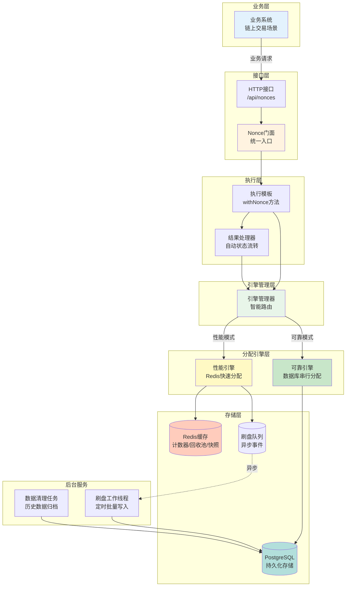
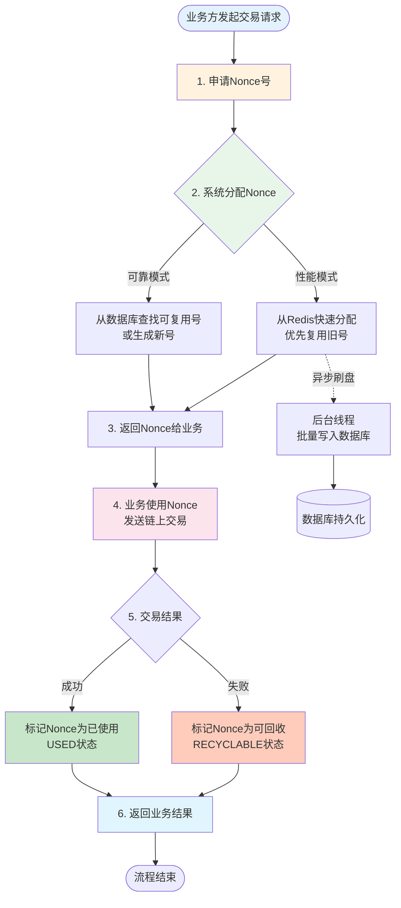
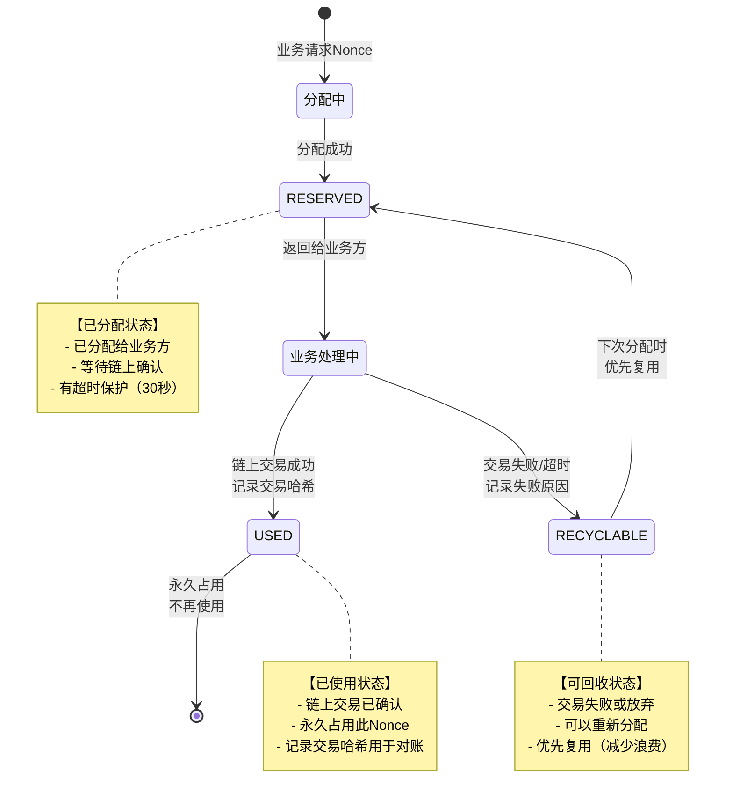
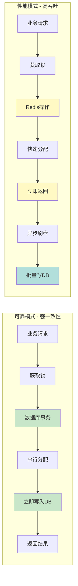
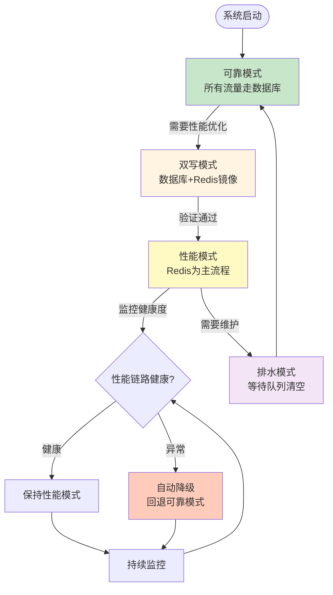
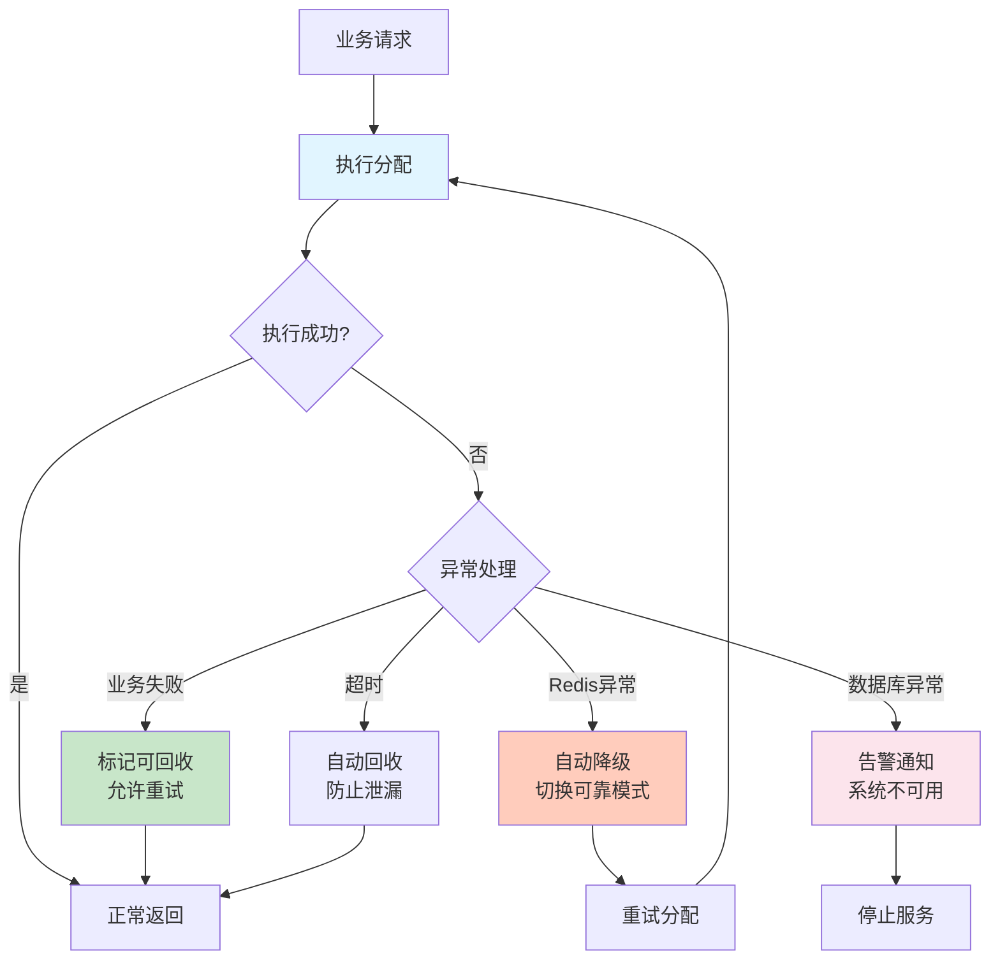
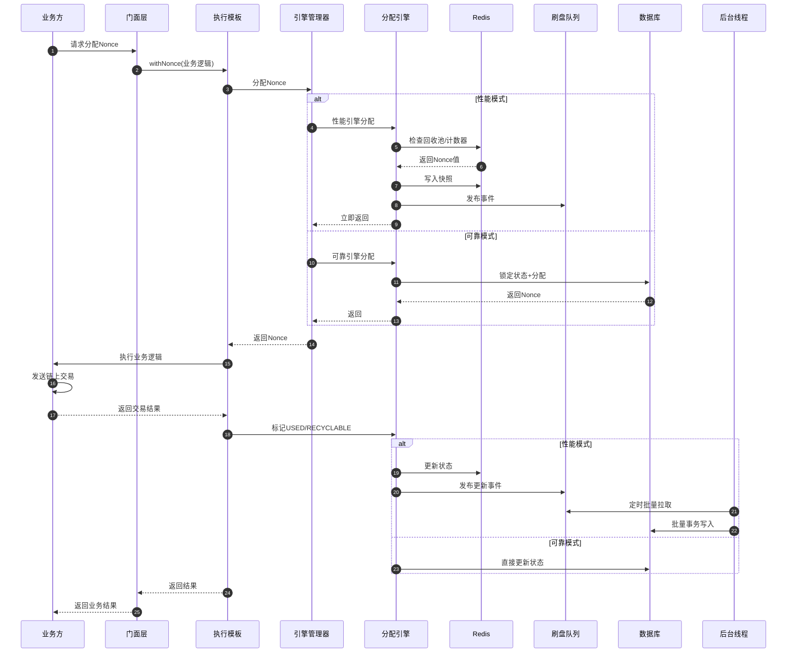

# Nonce管理系统 - 完整业务架构总览

> 面向产品、开发、测试团队的统一视图

## 系统全景图

## 核心业务流程（产品视角）

## Nonce状态生命周期

## 双模式运行机制

## 模式切换策略

## 异常处理和容错

## 数据流转全景

## 关键特性总结

### 🎯 产品价值
1. **零冲突保证**：确保链上交易Nonce唯一，避免交易失败
2. **高性能**：支持高并发场景，性能模式可达万级TPS
3. **高可用**：自动降级机制，保证服务连续性
4. **智能复用**：优先复用失败Nonce，减少资源浪费

### 🔧 技术亮点
1. **双模式设计**：可靠模式保证强一致性，性能模式保证高吞吐
2. **智能路由**：根据配置和健康状态自动选择最优模式
3. **平滑切换**：支持模式间无缝切换，不影响业务
4. **最终一致性**：性能模式通过异步刷盘保证数据最终一致

### 🛡️ 安全保障
1. **分布式锁**：Submitter级别锁，防止并发冲突
2. **事务保证**：数据库事务确保ACID特性
3. **超时保护**：RESERVED状态超时自动回收
4. **异常处理**：完善的异常处理和容错机制

### 📊 监控指标
1. **健康度检查**：Redis、队列、刷盘成功率
2. **性能指标**：响应时间、吞吐量、成功率
3. **告警机制**：异常自动告警，支持人工介入

