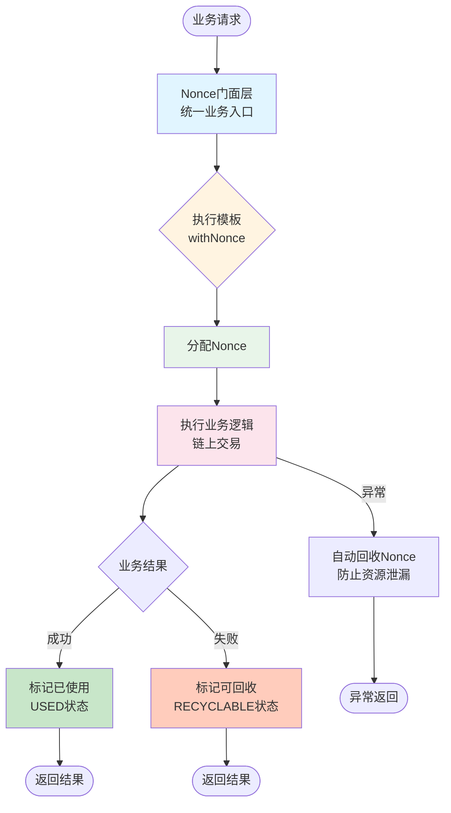
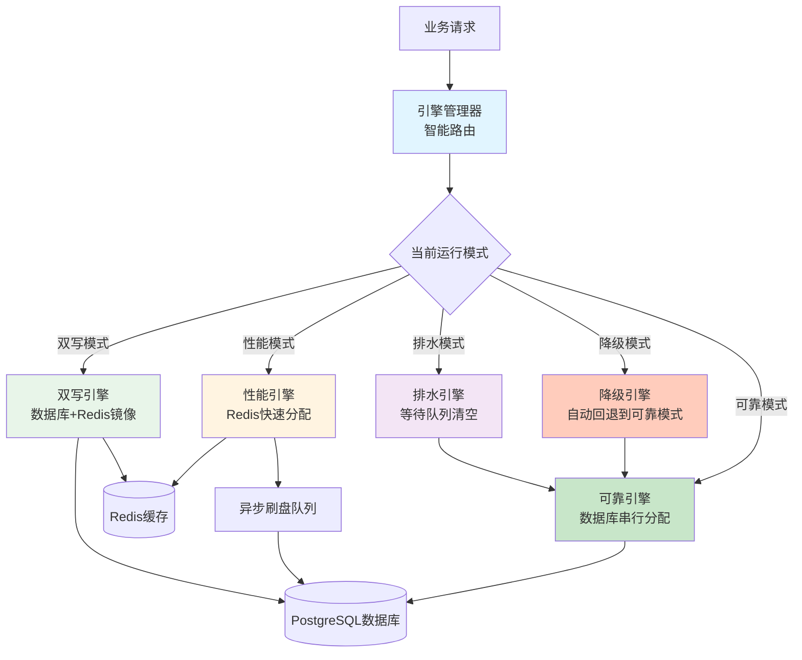
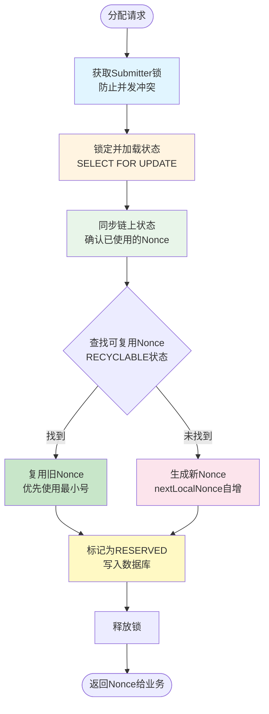
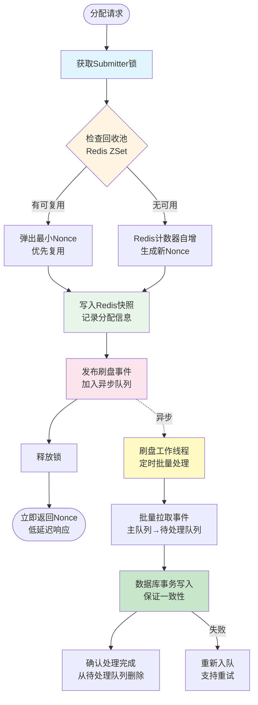
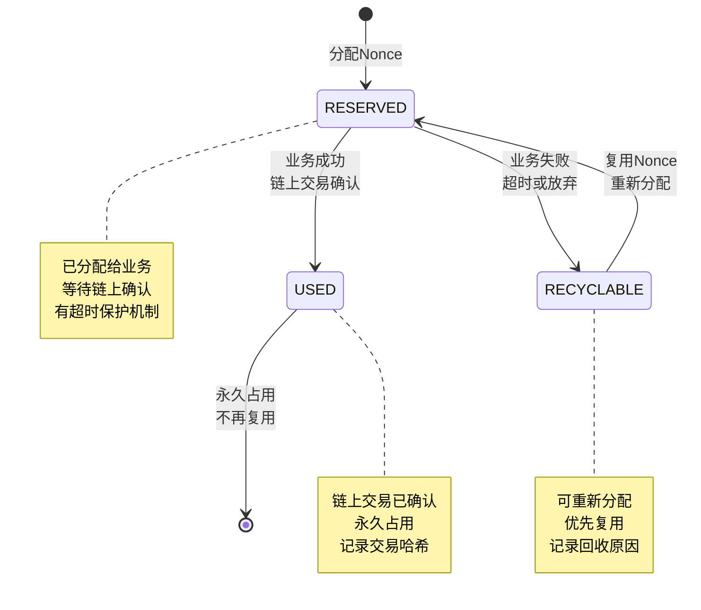
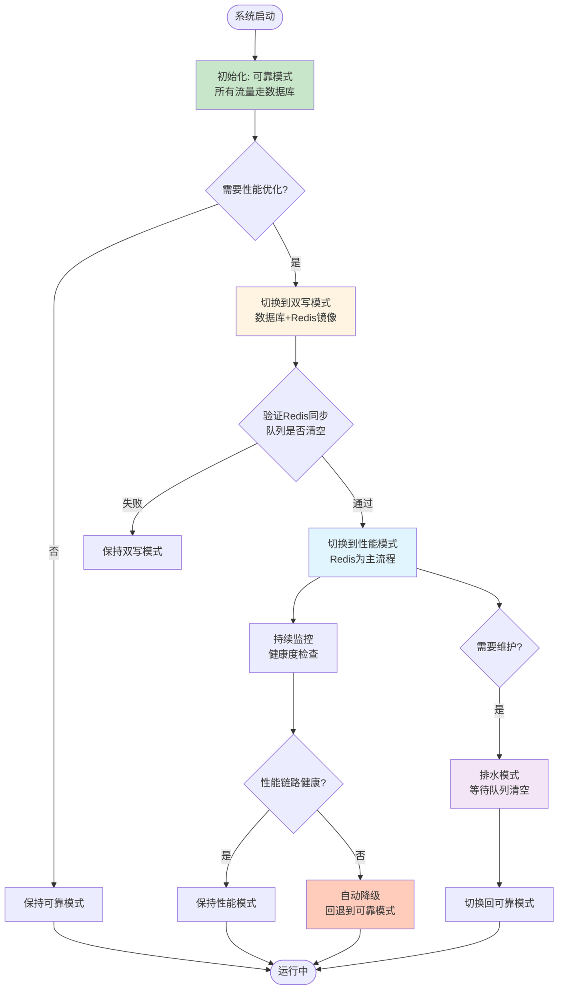
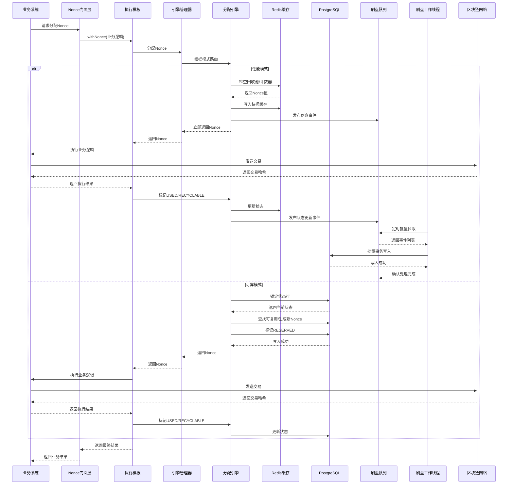
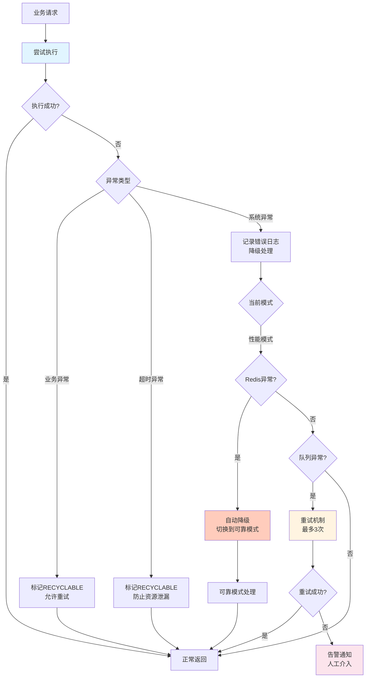
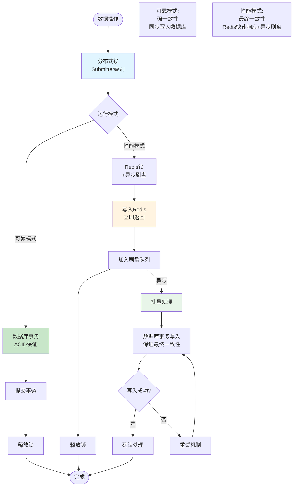
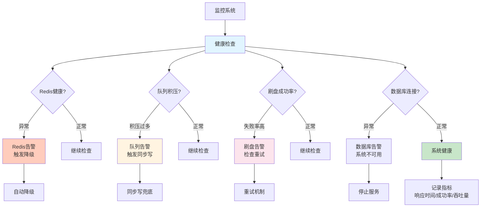

# Nonce管理系统 - 业务架构流程图

## 一、核心业务流程总览

## 二、Nonce分配引擎路由机制

## 三、可靠模式详细流程

## 四、性能模式详细流程

## 五、Nonce状态流转机制

## 六、模式切换流程

## 七、完整业务场景流程

## 八、异常处理和容错机制

## 九、数据一致性保障机制

## 十、系统监控和健康检查

---

## 关键设计要点总结

### 1. **双模式设计**
- **可靠模式**：强一致性，适合对数据准确性要求极高的场景
- **性能模式**：高吞吐量，适合高频交易场景，通过异步刷盘保证最终一致性

### 2. **智能路由**
- 引擎管理器根据配置和健康状态自动选择最优模式
- 支持平滑切换，不影响业务连续性

### 3. **状态管理**
- RESERVED：已分配，等待业务确认
- USED：已使用，永久占用
- RECYCLABLE：可回收，优先复用

### 4. **容错机制**
- 分布式锁防止并发冲突
- 自动降级保证服务可用性
- 重试机制保证数据最终一致性

### 5. **性能优化**
- Redis缓存加速分配
- 异步批量刷盘减少数据库压力
- 优先复用可回收Nonce，减少浪费

